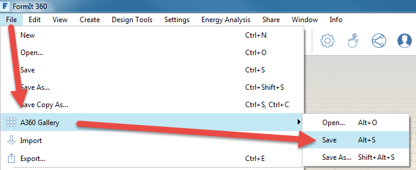

## Setting up the project

> Autdodesk 360 Drive is the primary storage medium for Formit. However, you can also, open, save, import and export files from a local drive. We will use that method for loading the datasets, but you will use your A360 drive accound to log into Formit and save your work as you move through the course.

---

### Download, install, start Formit 360
1. Visit [the formit 360 website](http://formit360.autodesk.com/page/download) to download the Windows version.
2. **Log into FormIt** using your ownAutodeak 360 credentials. 
3. Start a **new 'sketch' by clicking** the Gallery button &gt; new.
  
 - **Sign-in to your autodesk 360 account if you haven't already.**
  
 - **Name you your FormIt Sketch **_**"Farnsworth 01".**_

 - Click the **Gallery Icon and click save** to save this to the FormIt folder is your A360 Drive
  
 -  Each time you save to **A360 two things happen:**
    - A native FormIt file \(.AXM\) is saved to the FormIt folder in A360.
    - A few minutes later, a RVT File of the design will be copied to the FormIt folder in A360. We will review another way to bring FormIt.

4.**Change the Units** between **Imperial** and Metric using the **Settings Menu.**

