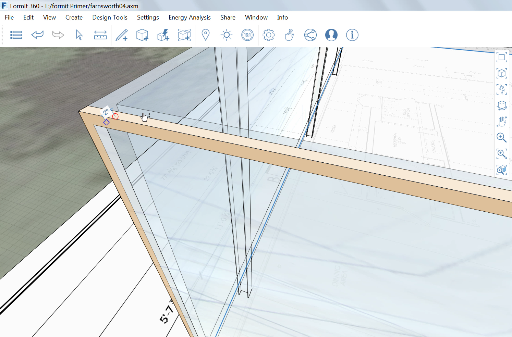

### Adding Detail

---

> If you did not complete the last section, download and open the **farnsworth04.axm** file from the [FormIt Primer folder](https://autodesk.app.box.com/s/thavswirrbflit27rbqzl26ljj7fu1uv/1/9025446442).

---

#### Door Frames

We are going to create a 2" metal frame and mullions around the window glass.

1. **Hide** the Roof Layer.

2. Use the [**Rectangle tool (R)**](../tool-library/rectangle-tool.md) to draw a surface over the western face of glass.

3. Use the [**Offset Face tool (OF)**](../tool-library/extrude-cut-and-offset-faces.md) and the **Tab key** to offset another rectangle **2"** towards the interior.

4. **Select** and **extrude** the frame 2" towards the interior. 

5. Group and name the assembly **EW Frame**.

6. Import and paint the column with the material **Metal &gt; Anodized – Gray**.

7. [**Copy** or **Array**](../tool-library/tilt-array-copy-and-paste.md) the assembly to the eastern side of the building.

8. Repeat steps 1-6 for the North and South sides as well.

#### Create Mullions

1. Using the same methods in the previous exercise, create a 2" thick and deep mullion **11'-10 ¾"** from the North West corner. 

2. Make the mullion the entire height of the glass walls (11'10").

3. Group and name the assembly **mullion**.

4. Import and paint the column with the material **Metal &gt; Anodized – Gray**.

5. [**Array**](../tool-library/tilt-array-copy-and-paste.md) them three times at a distance of **11'**.

6. Use the **hover + Tab key** to select all mullion instances and **copy** to the south side of the wall.

#### Create Door
Using the same methods as in the previous two exercises, create a 3'-6" double door centered in the western wall. 

---
####Related Topics:

[**Cover Sweep Loft**](../tool-library/cover-sweep-loft.md)