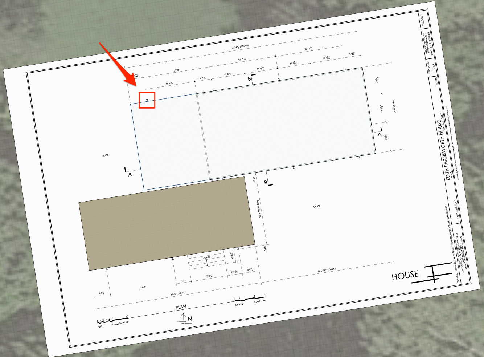
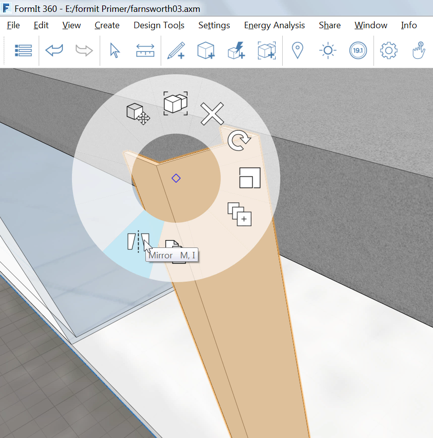
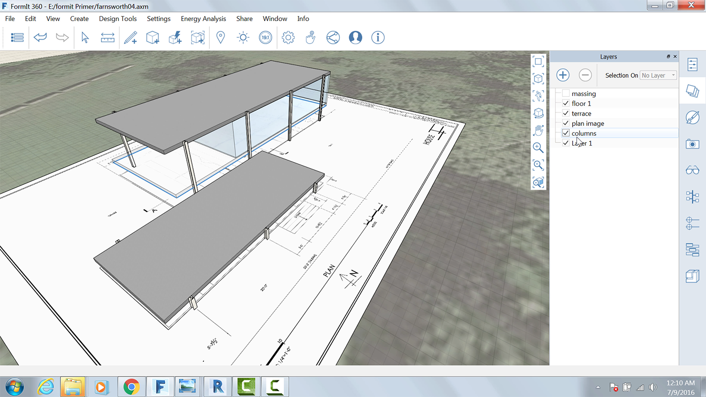

### Creating the Columns with Array
---

> If you did not complete the last section, download and open the **farnsworth03.axm** file from the [FormIt Primer folder](https://autodesk.app.box.com/s/thavswirrbflit27rbqzl26ljj7fu1uv/1/9025446442).

---

1. Zoom into the upper left of the drawing to where the column is indicated on the plan.

2. Use the [**Line tool (L)**](../formit-introduction/tool-bars.md) to make the following sketch. 

3. Once the shape is complete, **extrude it** and use snap to the top of the roof.

4. Double click to select the object. Right click and select the [**Mirror Tool (MI)**](../tool-library/mirror.md).

5. Move the Mirror widget and snap to the vertical edge of the column to create an I shape. 

6. Clean up the edges to create a single, solid shape. 

7. Group the column, edit the group and name it **Column Tall** and select **Generic** **Models** from the Category menu.

8. Import and paint the column with the material **Metal &gt; Anodized – White**.

### Array the Columns
---
1. Select the Column group.

2. Right click and choose [**Array (AR)**](../tool-library/tilt-array-copy-and-paste.md).

 

3. Use the following settings:
	- Length Between Copies
	- Linear
	- Number of Copies: 3

 

4. Press **OK**, and begin moving the cursor towards the right and lock on to the red axis.

5. Press Tab and enter **22'** – you now have four columns 22' apart.

6. **Hover over the first Column** and press the **Tab key** – all four columns will be selected.

7. Repeat the array, but this time do 1 copy of all four and snap the copies to the south side of the building. 

### Create Unique Groups
---

1. Repeat Step 7 above with the two columns on the southwest side of the building.

2. Copy them to the south side of the lower terrace.

3. **Right-click** both copied groups and select **Make Unique (M U)** - now both copied columns belong to a new group.

4. Edit one of the new groups and name it **Column short**.

5. Edit the group and shorten the new columns to the same height as the lower terrace. They should be **3’-2”**.

6. Using the plan image as a guide, copy Column short two more times to get to this result: