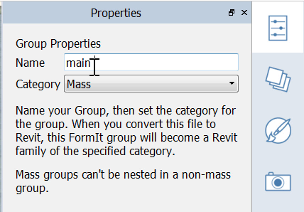

### Groups
---

>Any time you snap to a line or object in FormIt, a join occurs. To avoid this, you can Group an object(s). But this is not all, copies of Groups maintain their connection to the original. Editing any copy of a Group edits all of them. This is similar to Components in SketchUp and Family instances in Revit.

> If you did not complete the last section, download and open the **farnsworth02.axm** file from the [FormIt Primer folder](https://autodesk.app.box.com/s/thavswirrbflit27rbqzl26ljj7fu1uv/1/9025446442).

---

#### Creating and Editing a Group

1. Select the **first rectangular mass** that you created.

2. **Right click** and create a **Group (G)**. 

3. Select the Group by single-clicking. **Move** the entire Group up **4'-6"**. Press and hold the **Shift key** when the blue Z axis guide appears to lock onto that axis. 

4. It is important to name Groups as you will have many of them to keep track of. To name the Group, **double-click** to start the edit mode and then open the [**Properties Palette**](../tool-library/tool-bars-extended.md) to name the Group **"main building"**.  
    

5. Close the edit mode by clicking on the **check mark** in the upper left. 

**Note**: *Each Group has their own undo/redo "stack" that is distinct from the top level project.*

#### Apply Levels to a Group
---

1. Select the **main building by single-clicking** and open the [**Properties Palette**](../formit-introduction/tool-bars.md) of the Palette Bar.

2. Check the **Use Levels ON**. This will "slice" these masses by the levels you choose. Click **Check All**.

3. The **Area by Level** will display gross area of the currently selected object(s) and the area of each individual level.

4. If you do not see blue level lines on the object, go to the **Settings menu &gt; Visual Style &gt; Display Levels (DL)**.  
     
