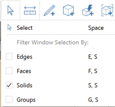

### Import/Export and Content Library
---------------------------------

> In this section we will use various tools to import and export data into and out of FormIt 360.

> If you did not complete the last section, download and open the **farnsworth06.axm** file from the [FormIt Primer folder](https://autodesk.app.box.com/s/thavswirrbflit27rbqzl26ljj7fu1uv/1/9025446442).

---

#### Import the Core and Furniture

1. Click File &gt; Import &gt; Import 3D Model (Ctrl + I) and Import the **core.axm** from the FormIt Primer/content/components.

2. **Hide Floor 1 layer** to see plan image below.

3. **Move the core** object roughly into place using the plan as an image.

4. Click File &gt; Import &gt; Import 3D Model (Ctrl + I) and Import **mies\_ottoman.SKP** from FormIt Primer/content/SKP and **place** it in the living area.

5. Select the **ottoman group**, right-click and choose **UnGroup All (U A)**. This will ungroup all nested groups. 

6. Select the ungrouped ottoman geometry. To make this easier, use the **Selection Filter** tool and choose **only Solids**. 

7. Re-Group this geometry. Edit the group and name it **Mies Ottoman**. Choose **Furniture** from the category list.  

#### Set Up and Use the Content Library
---

1. Open the [**Content Library Palette**](../formit-introduction/tool-bars.md).
     

2. Click the **+** icon to create a path to your local Content Library. Select the **FormIt Primer\\content** folder and click OK. 
     

3. Select the **Content folder** from the menu.  
     

4. Select the **Seating sub-folder**.  
     

5. Select the **Corbu Chair** and **place two** instances of it. 
     