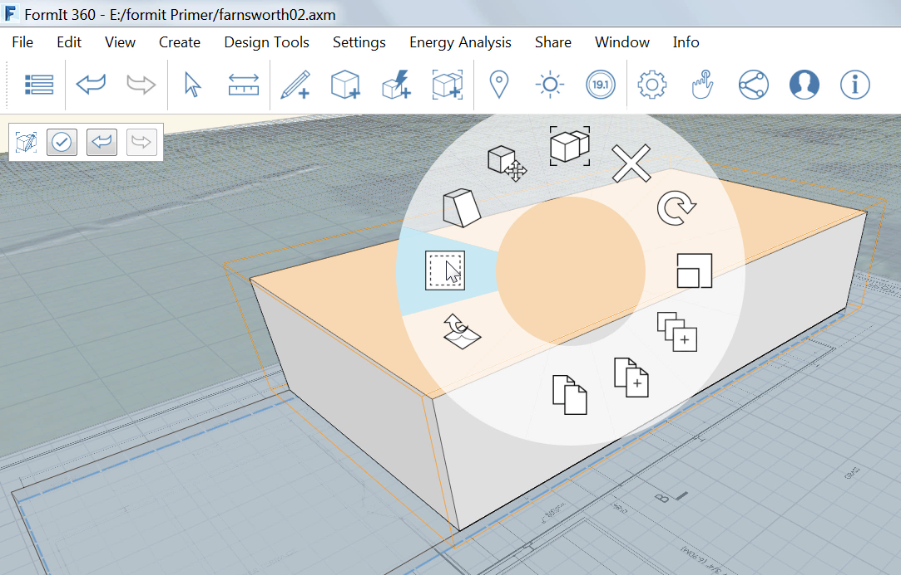

###Materials
---
> As we saw in the last exercise, you can apply materials to faces in FormIt. In this exercise you will create and edit your own materials and import materials from the Autodesk Materials library.

---

#### Create the glass walls
1. Use the [**Rectangle-Tool-(R)**](../tool-library/rectangle-tool.md) to create another surface on top of the floor, **28'-8" x 55'-5 ½"**.

2. Pull the new surface up **11'-2"**.

3. Group it and name it **Glass Walls**.

4. Right click on the top face and choose the [**Offset-Face-tool-(OF)**](../tool-library/extrude-cut-and-offset-faces.md).

5. Press **Tab** and type in **4"**. 

#### Import a New Material
---
1. Edit the **Glass Walls group** by double-clicking.

2. Select the [**Materials Palette**](../formit-introduction/tool-bars.md).

3. Click the **Import Materials button**.  
     

4. From the Materials Library, choose **Glazing** from the menu and then choose **Blue Reflective**. 

5. **Right-click** on the Blue Reflective material you just imported and choose **Paint with Material**. **Double-click the Glass Walls group** to apply the material.

**Note**: *Much like undo/redo, materials are applied and edited on a per group basis.*

1. **Copy the Floor 1 Group** to create the roof by holding the **Ctrl key** down while **dragging** the group. 

2. Make the copied Group unique, edit it and name it **Roof**. Import and paint the Roof with the material **Concrete &gt; White**.

3. Create the lower terrace by following the plan and using the Rectangle tool ( R ) **55' 3" long and 22'-7 3/4" wide** and extruding it **1'**. Group this and name it **Lower Terrace**.

4. Move it **2'-2"** off the ground.

5. Import and paint the Floor 1 and Lower Terrace with the material **Stone &gt; Travertine**.

6. Edit the Travertine material in both groups. Click the **Color value** and change it to **190** to lighten the effect of the material. 