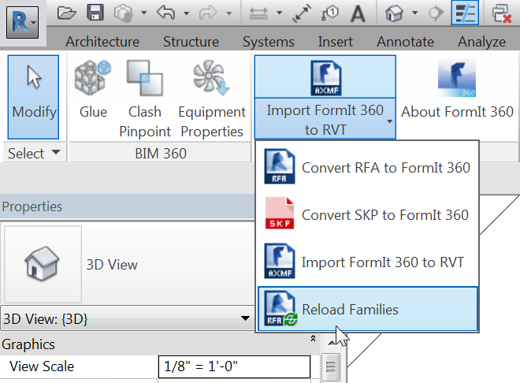

### Convert Revit Families for Use in FormIt
---

1. Open Revit 2016 or 2017 and start a blank file from the Architectural Template. 

2. From the Add-Ins tab select **Convert RFA to FormIt 360** from the FormIt 360 Converter. 

3. Set the first path to **FormIt Primer\\content\\RFA** and the Converted Files path to **FormIt Primer\\content** and press OK.

4. This process will take a number of minutes as Revit opens each RFA in the first path and converts it to a format that FormIt 360 can read.

**Note**: *You do not need to run this process during the tutorial, since all of the conversions have been made already. That is where the Corbu Chair and other content in the previous exercise came from.*

#### Import Data from FormIt into Revit
---

1. Still inside Revit, choose **Import FormIt 360 to RVT** from the add-in. 

2. Choose **farnsworth07.axm** from the FormIt Primer folder.

3. This process will take a few minutes as Revit converts each object in the FormIt file into individual Mass, Generic, and Furniture family instances. 

4. If we inspect the various objects, we will see that most are mass families. The Columns however, are Generic family. This will allow us to edit the family and convert to another category such as Structural Column.

5. The various furniture objects are Furniture category. There is one more tool that we can use to automatically swap out the ones that were converted in the previous exercise. Select **Reload Families** from the add-in. 

6. In the dialog, select **FormIt Primer\\content.** This will point the converter at all sub-folders under this folder. Press OK. This process will take a number of minutes as it looks at each family and tries to make a match and reload the proper RFA file in its place. 

#### Export Data from Revit into FormIt
---

There may be times when you need to bring data from Revit into FormIt – e.g. when you have an existing Revit project that needs an area of the design to be iterated on. Export a 3D scene to the SAT file format from Revit and you will be able to import that data back into FormIt.

**Note**: *Family and category information is not transferred back to FormIt 360.*
