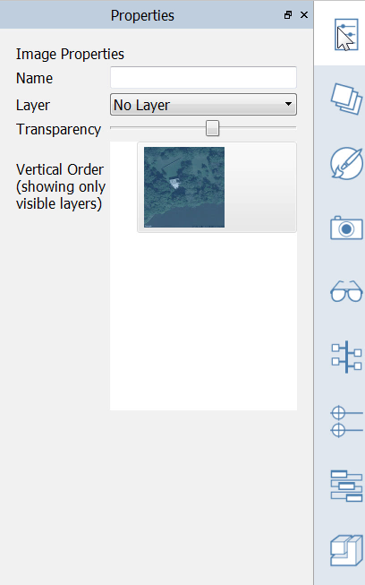

### Setting Location
---

> Setting your project’s location in the world is important for the accuracy of down-stream analyses. It also allows you to import a scaled satellite image to use as a background reference.

---

#### Set Location:

1. Set location to *Farnsworth House*:
    - Type ***Farnsworth House*** in the search field. Google Maps will fill in the actual location.
    - As soon as you commit the location search, the location is set to the center of the view.
2. You can now click **Finish** to set the location and return to the 3D scene.

Or you may optionally import a scaled satellite image:
    - Click **Import satellite image** and then **Finish Importing Image**.

    - Satellite image is imported to scale with True North facing up.
    - Go to the [**Visual Styles Palette**](../tool-library/tool-bars-extended.md) and enable **North Arrow** to see an interactive indicator of true north.
    - Once back in the 3D scene, **select the satellite image** by doubleclicking. Open the [**Properties Palette**](../tool-library/tool-bars-extended.md) and lower the transparency slider about **1/3**. 