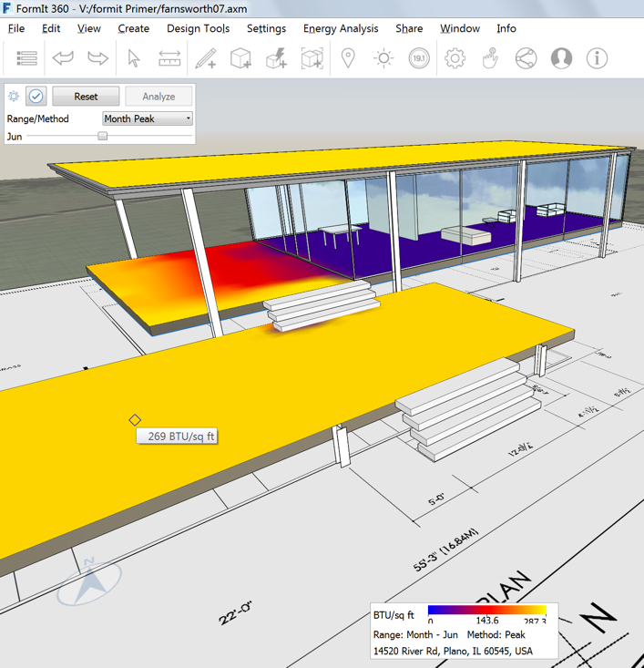

### Solar and Energy Analysis
---
> If you did not complete the last section, click the File &gt; Open and choose **farnsworth07.axm** from the FormIt Primer folder.

---

#### Shadows

Setting the location allows you to accurately analyze how sun shadows ill fall and affect your design – allowing you to make better decisions.

1. Click on the Sun Icon in the [**Action Tool Bar**](../formit-introduction/tool-bars.md) and check **Display Shadows**.

2. Move the Day and Hour sliders to see the shadow effects. Note in this house how the covered terrace is shaded during the hottest hours of the summer months – surely not an accident but a matter of design!   

#### Solar Analysis

1. From the same [**Sun menu**](../formit-introduction/tool-bars.md), click **Solar Analysis**.

2. Click on the surfaces you want to study and click **Analyze**.

3. The Month Peak setting displays the peak solar insolation in BTU/sq. ft for that month. Hover your cursor over an analyzed surface to get a specific value. 

4. The Year Cumulative setting displays the cumulative energy for the entire year in KwH/sq. meter. This is useful for gaining an early idea of solar PV potential for surfaces of your design. 

### Energy Analysis with Insight 360

1. Hide all of the layers except for Massing.

2. Click the **Insight 360 &gt; Generate Insight button.** Any visible masses with levels applied will be sent to Insight 360 for Analysis.   

3. Once the analysis is complete – click View Insight to view the results. Optionally, you can visit the website directly at [http://insight360.autodesk.com](http://insight360.autodesk.com/).