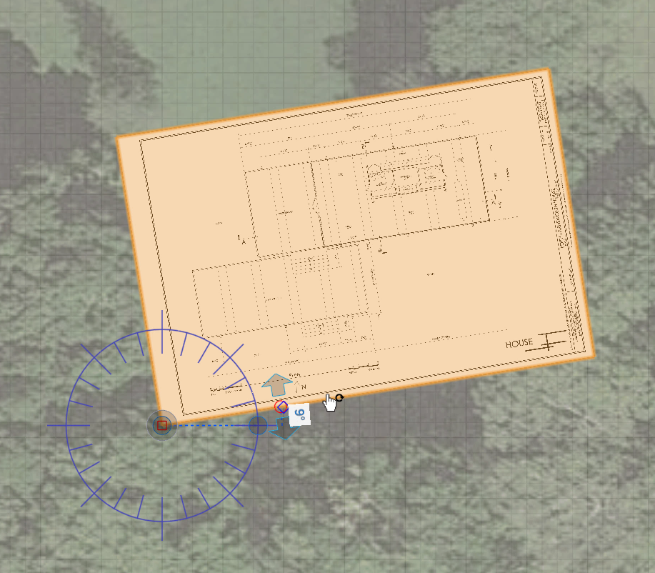

### Work with Images and the Ground Plane
---

You may import PNG images onto the ground plane by using the File &gt; Import menu. However, to gain more control over the scale and position, we will place a material texture onto a plane. The **plan.png** image is 3600 pixels wide by 2400 pixels high. By measuring the scale on the plan, we see that 1' is 25 pixels. This will allow us to scale the image properly in the scene.

1. Choose the [**Rectangle tool (R)**](../tool-library/rectangle-tool.md) and draw a rectangle **144'** by **96'** - use the **Tab key** to type in exact dimensions.

2. Open the [**Material Palette**](../formit-introduction/tool-bars.md) and click the **+** icon to create a new material.

3. Click the **folder icon** and open **plan.png** from the FormIt Primer/Drawings subfolder.

4. Enter **144'** in the Horizontal field and **96'** in the Vertical field and name the material "**Floor Plan**".

5. **Click OK** to return to the scene. In the [**Material Palette**](../formit-introduction/tool-bars.md) **right click** on the Floor Plan material and choose **Paint with Material** and then **click on the plane** you sketched.

6. **Double-click** the **entire plane** to select it. **Right click** and choose [**Rotate (Q)**](../tool-library/placing-and-modifying-objects/rotate.md). Move the Rotate widget to the bottom left corner and rotate the image **9 degrees counter clockwise**.

7. **Right click** on the **ground plane** and choose [**Set Axes (SZ)**](../tool-library/world-axes.md). Move the axis to the bottom left corner of the of the image plane. Move the axis so that it is alinged to the angle of the plane. The ground plan grid is now aligned to the image – which will make 3D sketching much easier.

