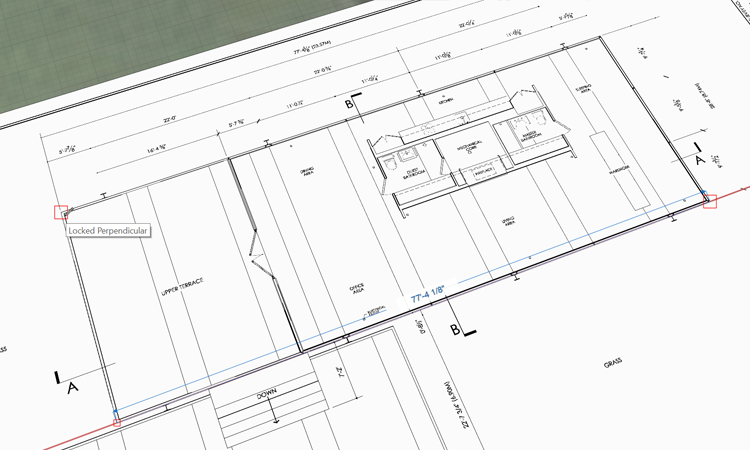
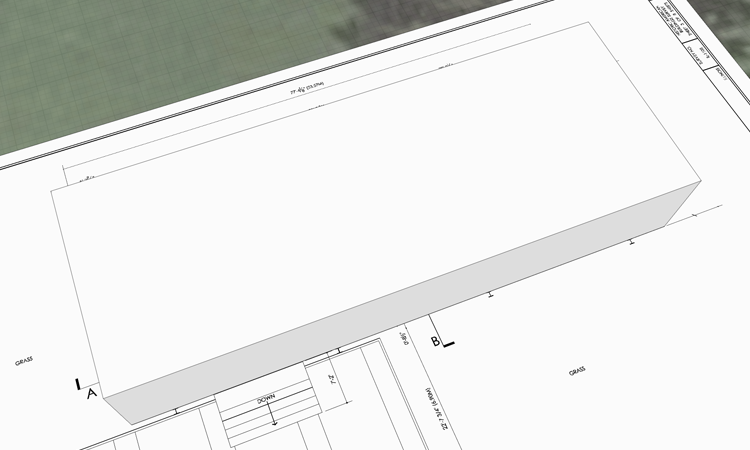

### 3D Sketch and Drag Face

Placing primitives is a fast way to get started, but the real power of FormIt is the ability to sketch in 3D. You got a sneak peak at the power of the snapping system when you used the Rotate tool in the last exercise. If you did not complete the last section, download and open the **farnsworth01.axm** file from the [FormIt Primer folder](https://autodesk.app.box.com/s/thavswirrbflit27rbqzl26ljj7fu1uv/1/9025446442).

#### Drawing Lines

1. Make sure that you're in the **3D Perspective** view by clicking the 3D cube in the Navigation bar

    

1. **Group** the rectangle in order to prevent new geometry from "sticking" to it. **Double click** the rectangle to select it. **Right-click** and choose **Group \(G\)**

    

2. Click the **Pencil** to open the [**Sketching Toolbar**](../formit-introduction/tool-bars.md) Choose the [**Line tool (L)**](../tool-library/line-tool.md)

    

4. You are ready to start sketching out the upper terrace of the Farnsworth house. Click [**here**](../tool-library/world-axes.md) to learn more about 3D sketching with World Axes. Now let's start by creating a rectangle on the imported image

6. Click **Settings &gt; turn off Snap to Grid \(S G\)**

7. While in the **Line tool**, click near **the upper left corner** of the upper terrace in the imported sketch 

8. **Move** your mouse along the red axis that appears. Click the **Tab key** to input the exact dimension. Make the long side **77'-4 1\8"** 

    

9. **Move your mouse** down along the green axis to define the short edge of the upper terrace. Set the dimension of the short side **28'-8**"

10. To define the other edge of the rectangle, **move your mouse** along the red axis and hold down the **Shift key**. The red axis line with thicken to indicate that the line is locked to this axis

     

11. While the **Shift key** is pressed - move your mouse to the first point you drew. Click to commit the end point.

12. Release the **Shift key** and click the first point you drew to finish enclosing the rectangle. Press **Esc** twice to clear the sketch tool 

#### Drag the Face

13. **Single click** inside the outline you just drew to select it the face. You are automatically in the drag face tool

    

14. **Single click** to start the drag face operation. Move your mouse up to drag in that direction. Click **Tab** and input **12'-2"**. You've created a mass!

    

**Note**: _The red and green axes keep you parallel and perpendicular to the grid. When you draw a line off of the world axes, a purple axis line will allow you to stay 90 degrees relative to your off axis line_

#### 3D Sketching with Arc, Spline, and Circle

The following exercise is not critical to finishing the house. It will allow you to experiment with some of the other 3D Sketching tools.

2. Select the [**Arc tool**](../tool-library/arc-tool.md). Click to define the start, and then the end point. The third click defines the radius of the circle that defines the arc

3. Select the [**Spline Tool**](../tool-library/spline-tool.md). Click to define any number of points to draw a spline

4. Select the [**Circle Tool**](../tool-library/circle-tool.md). Hover and Click to define the center point of the circle. Click and drag to define the radius of the circle.

**Note:** _When you snap any curve segment to any other point, line or object face/edge/point, the objects will now be joined as one object. To avoid this, we will use Groups in a later exercise._

