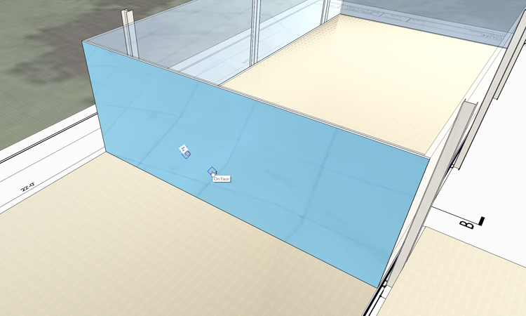
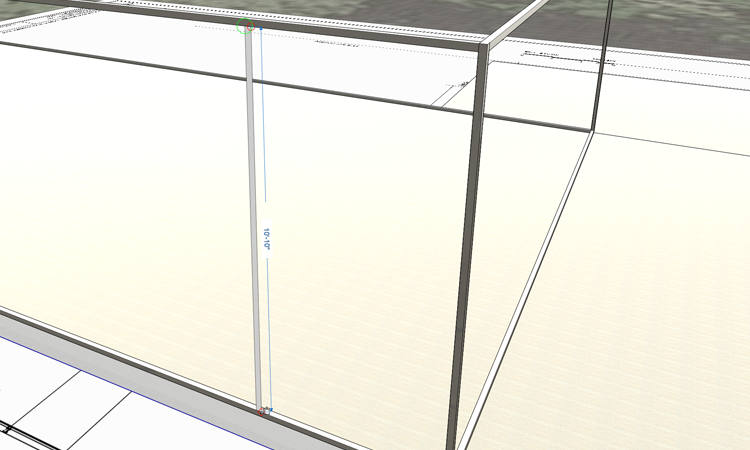

### Adding Detail
FormIt is a great massing tool - and it is **also** a great modeling tool. We'll start to add detail to the Farnsworth house in the form of doors and mullions for the glass box. We'll cover some additional tools, and practice the process of adding new geometry, layers, materials, and group management.

If you did not complete the last section, download and open the **farnsworth04.axm** file from the [FormIt Primer folder](https://autodesk.app.box.com/s/thavswirrbflit27rbqzl26ljj7fu1uv/1/9025446442).

#### Create Window Frames
We are going to create a 2" metal frame and mullions around the glass box. These mullions will overlap with the glass box, and that is intentional

1. Create a new layer called **glass walls** and put the glass box onto this layer

1. **Turn off** the **Roof** layer so we can see the entire glass box. Turn on the **North Arrow** with the **DN** keyboard shortcut

2. Use the [**Rectangle tool (R)**](../tool-library/rectangle-tool.md) to draw a surface over the western face of glass. _**Note**: Since the glass box is grouped, then this new rectangle will **not "stick"** to the glass box_

3. **Single click** to select the new face, then **single click** to start a drag face. **Push** the face 2" towards the interior. Click **Esc** to clear the selection. 

4. If you have trouble selecting the new face, turn off the **glass walls** layer, or hover on the face, hit the **space bar** to choose different selection candidates

    
    
3. **Single click** the face you just created. **Right click** to access the context menu. Use the [**Offset Face tool (OF)**](../tool-library/extrude-cut-and-offset-faces.md)

4. Move your mouse toward the inside of the face. Hit the **Tab key** and enter **2"** to create a new rectangle. Click **Esc** to clear the selection

5. **Single click** to select the interior rectangle you just created. Click again to start a drag face. **Push** this face through the model to remove it

6. **Double click** to select the mullion frame. **Group (G)** the selection

    
    
7. Create a layer named **mullions** and  put the new group on it

8. Edit the mullion group by **double clicking** it. Name it **EW Frame** in the **Properties palette**

6. Import and paint the **mullion group** with the material **Metal &gt; Anodized – Gray**

7. **Quick copy**, **Array** or **Mirror** the mullion to the eastern side of the building

8. Repeat the steps above for the **North and South** sides of the glass box

    

You may want to turn off the **columns** layer. The mullion frames will overlap each other at the corners and this is intentional

    
#### Create Mullions

1. Turn off the **glass walls** layer. **Orbit** the camera so you're viewing the **North** side of the glass box

2. Draw a **Rectangle (R)** vertically between the top and bottom of the frame. The rectangle should be **2" wide and 10' 10" tall**

    

2. Push the face inward 2" to make a mullion. Group it and name the group **mullion**. Put the mullion on the **mullions layer**

4. Paint the mullion with the material **Metal &gt; Anodized – Gray**

#### Locate Mullions
We want this mullion to appear at the midpoint between the columns. We'll draw a 'guideline' to help us locate the mullion correctly

3. Turn on the columns layer. Draw a **Line (L)** between the end points of two columns

    

4. We'll use the **Measure** tool to get the mullion in the right place

5. [**Array**](../tool-library/tilt-array-copy-and-paste.md) them three times at a distance of **11'**.

6. Use the **hover + Tab key** to select all mullion instances and **copy** to the south side of the wall.

#### Create Door
Using the same methods as in the previous two exercises, create a 3'-6" double door centered in the western wall.

---
####Related Topics:

[**Cover Sweep Loft**](../tool-library/cover-sweep-loft.md)