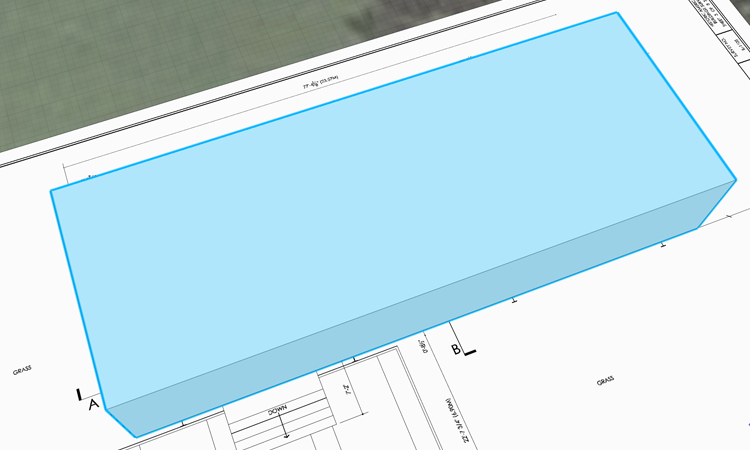

###Levels
Levels allow you to slice masses with individual floor datums and calculate gross area per building mass. FormIt Levels and their custom names will translate to Revit Levels when the file is converted to Revit

#### Create, and Customize Levels
1. Create levels using the [**Level Palette**](../formit-introduction/tool-bars.md) in the **Palette Bar**.

    

2. Click **+** (**Add Level**) four times to add four Levels

3. **Double click** the Elevation to set the heights to **0’-0", 2'-2" , 4’-6" **and** 15’-8"** 

3. **Double click** the Name to give the Levels custom names **Level 1, Terrace, Floor 1, **and** Top of Cornice**

    

**Note**: You can click the **++** icon to create multiple levels, a specificed distance apart. Very handy for tall buildings

#### Apply Levels to Geometry

4. In the previous steps we only created levels - we haven't yet applied them to our mass

5. Select the entire mass by **double clicking** it 

    

6. In the [**Properties Palette**](../formit-introduction/tool-bars.md), click **Use Levels** 

7. You can uncheck Levels you don't want to contribute towards gross area. **Uncheck** Floor 1 and Terrace so only the **Level 1** is checked 

8. The Properties Palette now reads the area of this mass!

    

**Note**: If you do not see blue Level lines on your mass, type DL to Display Levels.

