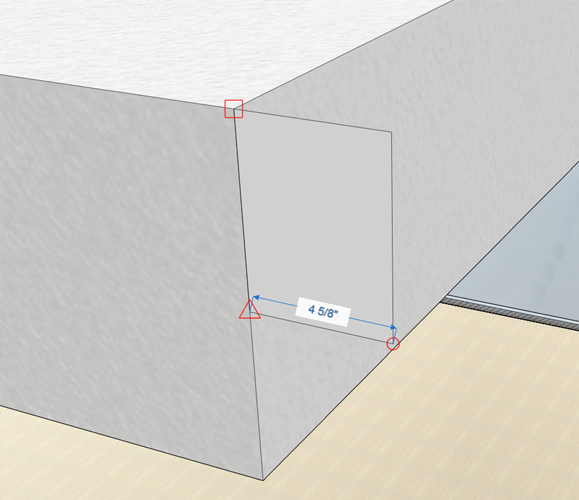
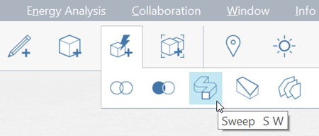
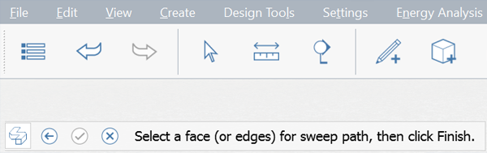
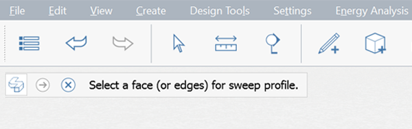

### Advanced Modeling
In our Farnsworth House exercises we've focused on basic modeling tools like Sketching, Drag Face, Move, Array, and Offset Face. We've also covered the essential workflows involving Groups, Layers, Materials and Levels. In this section we'll introduce you to the Advanced Modeling tool **Sweep**!

If you did not complete the last section, download and open the **farnsworth05.axm** file from the [FormIt Primer folder](https://autodesk.app.box.com/s/thavswirrbflit27rbqzl26ljj7fu1uv/1/9025446442).

#### Sweep
Use the Sweep tool to create a cornice along the roof

1. With the **Rectangle (R)** tool, create a **6" high by 4 5/8"** profile at any corner of the roof

    

2. Create another **Rectangle (R)** profile that is **2" x 2"** 

    

3. **Single click** to select the line between the profiles. Use the **Delete** key to remove the line - this creates a single outline 

    

4. Select the [**Sweep tool (SW)**](../tool-library/cover-sweep-loft.md) from the [**Advanced Modeling menu**](../formit-introduction/tool-bars.md)

    

5. Note the toolbar that appears in the upper left corner of the canvas. Note the helper text with instructions. 

6. **Single click** the face you just drew. This will be profile you want to sweep. Note the toolbar in the upper left corner advances automatically when you select a face

    

6. Now select the top face of the roof to act as the path. Click the **check box** to complete the sweep

    

7. Double click to select the entire cornice element. **Group (G)** the cornice. Edit the group and name it **Cornice**

8. Paint the cornice group with the material **Concrete &gt; White** to match the roof. Put the **cornice group** on the **roof** layer

#### Advanced Modeling – Fillet

Use the Fillet tool to create a rounded edge for the bed.

1. Create a **4' x 7' x 1'-6" high** rectangle in the living area of the house.

2. Select the [**Fillet tool (FI)**](../tool-library/cover-sweep-loft.md) from the **Advanced Modeling tools** in the [**Action Tool Bar**](../formit-introduction/tool-bars.md).

    

3. Select the top face and choose **2"** as the fillet distance. Click the **check mark** in the top left corner to finish.

    

