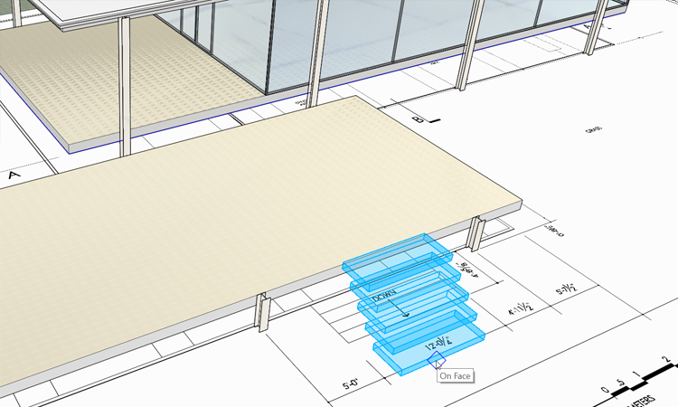

### Computational Groups with Dynamo
In this section we will leverage the computational power of [Dynamo](http://dynamobim.org/) to place and modify flexible groups.

If you did not complete the last section, download and open the **farnsworth06.axm** file from the [FormIt Primer folder](https://autodesk.app.box.com/s/thavswirrbflit27rbqzl26ljj7fu1uv/1/9025446442).

#### Place and Modify Dynamo Groups

1. Open the [**Dynamo Palette**](../formit-introduction/tool-bars.md) in the Palette Bar

    

2. Click the **+** icon to **add Dynamo content** from a URL

3. Paste the following URL into the dialog **<https://www.dynamoreach.com/share/5780fb888794379c4b65b941>**. This will refresh the Dynamo panel to include a **Simple Stair tool** 

    

4. Single click the **Simple Stair**. FormIt will load the Dynamo graph, this will take a few seconds

5. Once the stair is loaded, move your cursor over the canvas, near the terrace. Click to place the stair

    

5. Go to the **Plan view** and **place the stair** roughly centered where the stair to the lower terrace appears on the plan. 

6. Double click the Group to edit it and go to the [**Properties Palette**](../formit-introduction/tool-bars.md).

7. Modify the settings:  

    

8. Once it is placed, **copy** the stair to the upper terrace. Right click on copied group and select **Make Unique (M U)**.

9. Double click the copied group to edit and **change the Floor to Floor height setting** to **1.5**.