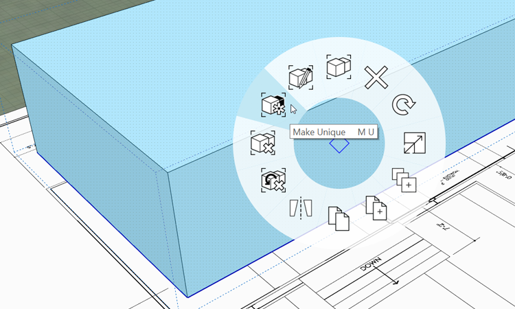

### Control Visibility with Layers
Much like AutoCAD and Photoshop, Layers in FormIt allow you to manage the visibility of objects in your scene. We are going to create a layer to save and hide the building mass for analysis in the future.

#### Create Layers

1. Go to the [**Layers Palette**](../formit-introduction/tool-bars.md) and click the **+** sign three times to create three layers

2. Double click the layer names to rename them **Massing**, **Floor 1**, and **Plan Image**
     
     

3. Select the **main building** group and choose the **Massing** layer from the **Selection On:** drop down at the top of the Layers tab

10. **Single click** to select the **plan image** group and put it on the **Plan Image** layer

#### Duplicate Group

4. Select the **main building** group again 

5. Press **Ctrl + C** to copy, and then **Ctrl + Shift + V** to paste the mass in the same place

5. The **new** copy is still selected. **Right click** and choose **Make Unique (MU)**

     

**Note**: The new Group is now severed from the original and they will not update each other any longer

#### Create the Floor

6. **Single click** to select either of the **main building** groups

7. Put the group on the **Floor 1** layer using the **Selection On** drop down in the Layers panel

8. Uncheck the **Massing** layer to hide it - and keep it safe from any accidental edits!

9. **Double click** the **Floor 1 Group** to edit it. Re-name the group **Floor** in the Properties palette

10. **Single click** the **top face** to select it. Click again to start dragging the face down, click the **Tab key** and enter **11'2"**. The resulting floor should be 1' thick

11. **Double click** off in space to exit the group

     

