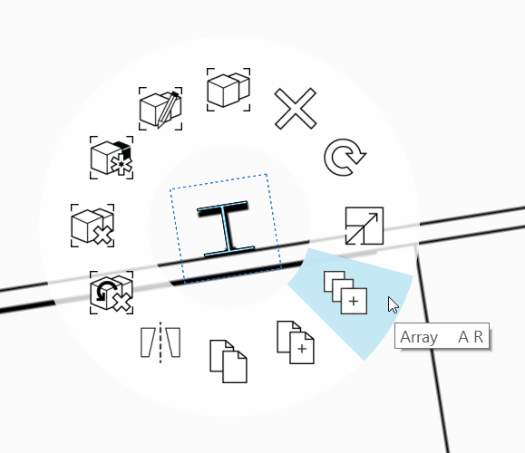
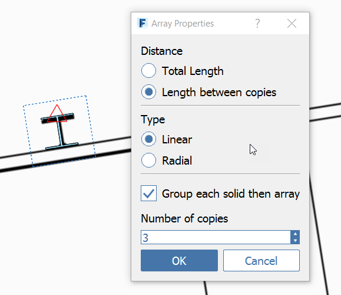
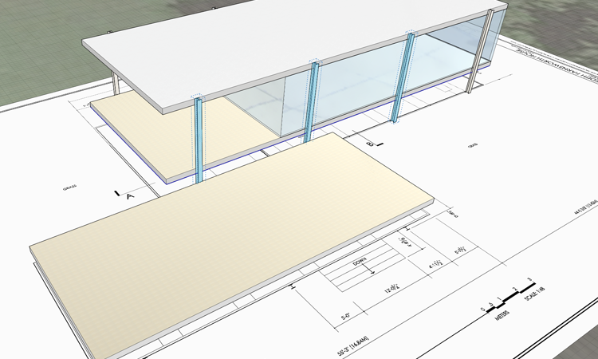

### Create Columns with Array
In this exercise we'll sketch a detail element - an I beam column. Then use the Array tool to copy multiple items with a specific distance between them.

If you did not complete the last section, download and open the **farnsworth03.axm** file from the [FormIt Primer folder](https://autodesk.app.box.com/s/thavswirrbflit27rbqzl26ljj7fu1uv/1/9025446442).

### Sketch the Column Profile
1. Go to the **Top View (ZT)** to view the plan image from above 

	

2. **Turn off** the **Floor 1** layer so that you don't snap to the **Roof or Floor** geometry we drew in the last exercise

3. Zoom into the upper left of the **imported floor plan** image so you can view the column in detail

	

4. Turn off the **Snap to Grid (SG)** feature if you have it on. This will help with drawing details like this 

5. Use the [**Line tool (L)**](../formit-introduction/tool-bars.md) to make the following sketch using the specified dimensions

	

3. Once the outline is complete, the profile becomes a face. Select the face with a **single click**

### Extrude, Mirror, and Join the Column

1. While the profile is still selected, go to the **3D View (ZD)** to change to the perspective view 

	

3. You'll be zoomed out to see the entire model, but you can zoom to your selection with the **ZS** keyboard shortcut! You'll most likely need to scroll zoom back a bit as you'll be too close to the small profile

	

3. Click to select the face, and again to start the drag face operation on the column profile. Startt to **extrude** the column

4. Turn on the Floor 1 Layer. Snap to the top of the roof to determine the height of the column

4. Double click to select the object. Right click and select the [**Mirror Tool (MI)**](../tool-library/mirror.md).

5. Move the Mirror widget and snap to the vertical edge of the column to create an I shape. 

	

6. Clean up the edges to create a single, solid shape. 

	

7. **Double click** to select the column. **Group (G)** the column

8. **Double click** to edit the group and name it **Column Tall** and change the Category to be **Generic Models** from the drop down menu

8. Import the material **Metal &gt; Anodized – White**. Then **Paint (PT)** the material onto the Column group

### Array the Columns
1. Select the Column group.

2. Right click and choose [**Array (AR)**](../tool-library/tilt-array-copy-and-paste.md).

	

3. Use the following settings:
	- Length Between Copies
	- Linear
	- Number of Copies: 3

 	

4. Press **OK**, and begin moving the cursor towards the right and lock on to the red axis.

5. Press Tab and enter **22'** – you now have four columns 22' apart.

6. **Hover over the first Column** and press the **Tab key** – all four columns will be selected.

7. Repeat the array, but this time do 1 copy of all four and snap the copies to the south side of the building. 

	

### Create Unique Groups

1. Repeat Step 7 above with the two columns on the southwest side of the building.

2. Copy them to the south side of the lower terrace.

3. **Right-click** both copied groups and select **Make Unique (M U)** - now both copied columns belong to a new group.

4. Edit one of the new groups and name it **Column short**.

5. Edit the group and shorten the new columns to the same height as the lower terrace. They should be **3’-2”**.

6. Using the plan image as a guide, copy Column short two more times to get to this result:

	