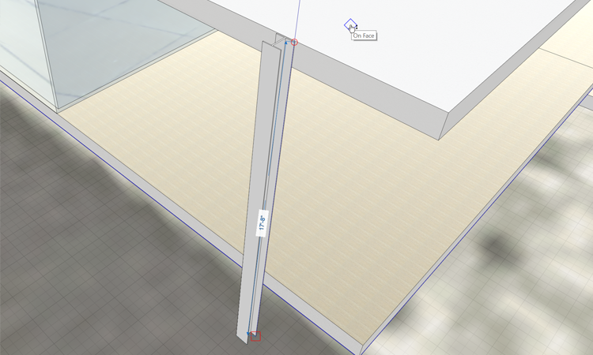

### Create Columns with Array
In this exercise we'll sketch a detail element - an I beam column. Then use the Array tool to copy multiple items with a specific distance between them.

If you did not complete the last section, download and open the **farnsworth03.axm** file from the [FormIt Primer folder](https://autodesk.app.box.com/s/thavswirrbflit27rbqzl26ljj7fu1uv/1/9025446442).

### Sketch the Column Profile
1. Go to the **Top View (ZT)** to view the plan image from above 

	

2. **Turn off** the **Floor 1** layer so that you don't snap to the **Roof or Floor** geometry we drew in the last exercise

3. Zoom into the upper left corner of the **imported floor plan** image so you can view the column in detail

	

4. Turn off the **Snap to Grid (SG)** feature (if you have it on). This will help with drawing detail lines

5. Use the [**Line tool (L)**](../formit-introduction/tool-bars.md) to make the following sketch using the specified dimensions

	
	
6. **Turn off** the **Plan Image** layer so that you can see the profile lines

4. **Double click** to select the entire profile. **Right click** and select the [**Mirror Tool (MI)**](../tool-library/mirror.md).

5. **Single click** to select the orange center grip of the Mirror widget. **Move** it and click to snap to the mid point of the long edge

	

6. **Single click** the lower arrow and move it 90' clock wise. Snap it to the blue compass line. The result should look like an I beam profile

	

6. **Single click** off in space to commit the mirror command. Click **Esc** to clear the selection

7. **Double click** to select one of the profiles. Hold down the **Ctrl** or the **Shift** key and **double click** the other profile. Both of the profiles should be in selection

8. **Right click** to bring up the context menu. Choose the **Join Geometry (JC)** command to merge the two profiles into one

	

9. Once the outline of the profile is complete, the profile becomes a single face. Select the face with a **single click**

### Extrude and Array the Column

1. While the profile is still selected, go to the **3D View (ZD)** to change to a perspective view 

	

3. Zoom to your selection with the **ZS**! You'll need to **scroll zoom** back as you're too close to the small profile

	

3. Click to select the profile face, and click again to start the drag face operation. Start to **drag the face** up

4. Turn on the **Floor 1** layer. Click on the top of the roof to snap the height of the column - it should be **17' 8"**

	

7. **Double click** to select the column. **Group (G)** the column

8. **Double click** to edit the group and name it **Column Tall** and change the Category to be **Generic Models** from the drop down menu

8. Import the material **Metal &gt; Anodized – White**. Then **paint** the material onto the column group

9. Click **Esc** to clear the paintbrush tool

### Array the Columns
1. Go to the **Top View (ZT)** to view the plan image from above 

	

2. **Turn off** the **Floor 1** layer, **turn on** the **plan image** layer

1. **Single click** to select the column group. **Right click** and choose [**Array (AR)**](../tool-library/tilt-array-copy-and-paste.md).

	

3. Use the following settings in the **Array** dialog: **Length Between Copies**, **Linear**, **Number of Copies: 3**. Press **OK** to close the dialog

	

4. **Single click** to start the **array**. Move the cursor to the right, along the red axis. Hold down **Shift** to lock to the red axis

5. Press the **Tab key** and enter **22'**. You now have **four** columns **22'** apart

6. **Hover over the first Column** and press the **Tab key** – all four columns will be selected.

7. Repeat the array, but this time do 1 copy of all four and snap the copies to the south side of the building. 

	

### Create Unique Groups

1. Repeat Step 7 above with the two columns on the southwest side of the building.

2. Copy them to the south side of the lower terrace.

3. **Right-click** both copied groups and select **Make Unique (M U)** - now both copied columns belong to a new group.

4. Edit one of the new groups and name it **Column short**.

5. Edit the group and shorten the new columns to the same height as the lower terrace. They should be **3’-2”**.

6. Using the plan image as a guide, copy Column short two more times to get to this result:

	