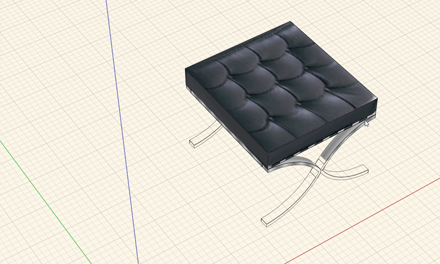
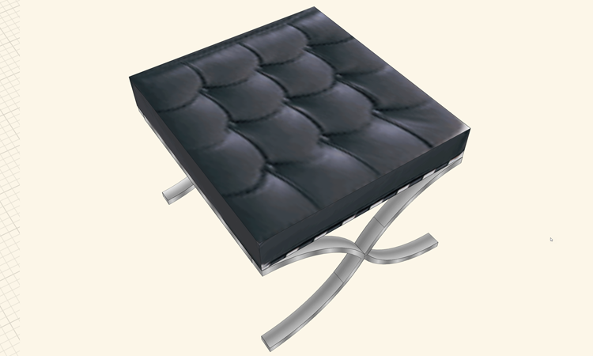
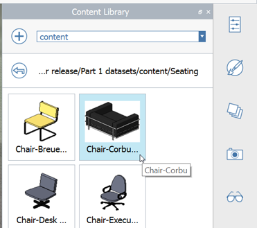

### Import/Export and Content Library
In this section we will import models existing models from the SketchUp warehouse, and use the FormIt Content Library to place Families we've converted from Revit. **Note** that SKP files import to FormIt with Materials, Groups and Components, Layers and Scenes in tact

If you did not complete the last section, download and open the **farnsworth07.axm** file from the [FormIt Primer folder](https://autodesk.app.box.com/s/thavswirrbflit27rbqzl26ljj7fu1uv/1/9025446442).

#### Import SKP files
First we'll go through the process of adding a piece of downloaded content to your own personal content library

4. Start a new session of FormIt - you can either **Save (Ctrl + S)** your existing work, and start a **New file (Ctrl + N)**, or start another session of the app, so you have two running side by side

5. In an empty FormIt scene, click File &gt; Import &gt; **Import 3D Model (Ctrl + I)** and Import **mies\_ottoman.SKP** from **FormIt Primer/content/SKP**

     

5. **Double click** to edit the **ottoman** group. Name the group **Mies Ottoman** and set the category to **Furniture**

6. Ensure **Snap to Grid (SG)** is on. Draw a reference **Line (L)** starting at the origin point defined by the X, Y, Z axis. Click anywhere to place the second point

7. **Single click** to select the **ottoman** group. Click the lowest corner of the leg to set the **start point** of a **move command** 

     
     
7. **Single click** to place the **ottoman** group at the origin. Clear the selection with an **Esc**, then delete the reference line  

     

7. Turn off the **Grid (DG)** and the **X, Y, Z axes (DZ)** and do a **Zoom All (ZA)**. FormIt will store the current [**Visual Styles**](/Building-the-Farnsworth-House/Visual-Settings.md) for the **Content Library** thumbnail preview image

     

8. **Save As (Ctrl + Shift + S)**. Put the file in the **content\Seating** folder with the name **Mies Ottoman.AXM**. Note that an **example** is there in case you want to review

You can follow the same steps above with the **Mies_van_der_Rohe_Couch** and the **mob_cadeira_barcelona** files in the **content\SKP** folder

####Link a Content Library

1. Open the [**Content Library Palette**](../formit-introduction/tool-bars.md)

     

2. Click the **+** icon to link a Content Library folder. Click the **+** icon in the dialog to define a path to a local folder 

3. Select the **FormIt Primer\content** folder and click OK

     

####Place Content from the Library

1. Turn off the **roof** layer

3. Look in the **Content Library** palette and select the **content** folder** from the drop down menu

     

1. Click the **components** folder and drag and drop **core** into the canvas

2. **Hide Floor 1 layer** to see plan image below.

3. **Move the core** object roughly into place using the plan as a guide

4. Select the **Seating sub-folder**.

     

5. Select the **Corbu Chair** and **place two** instances of it. 

     
     
     