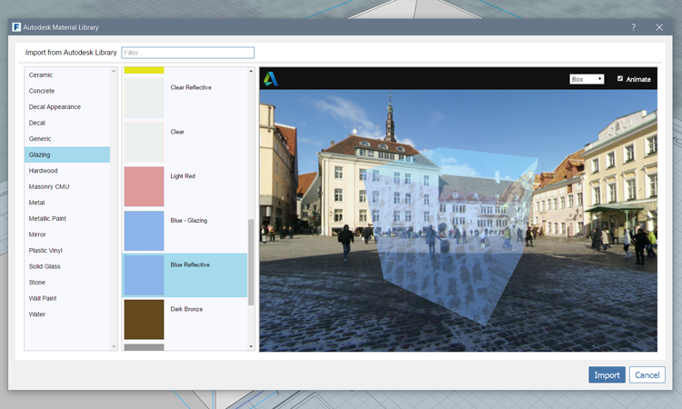
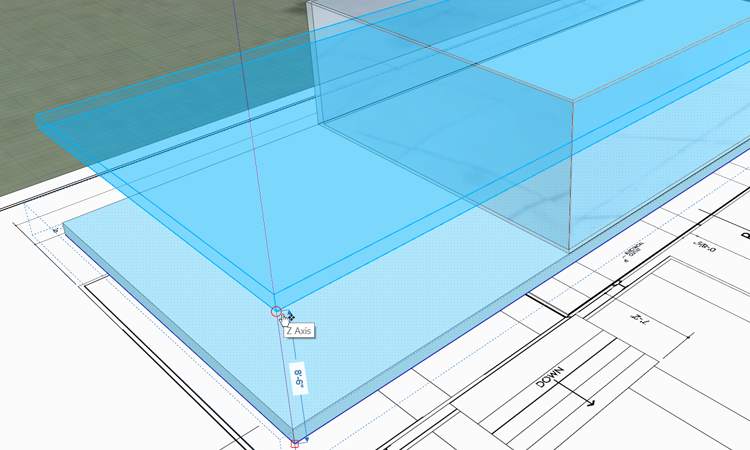
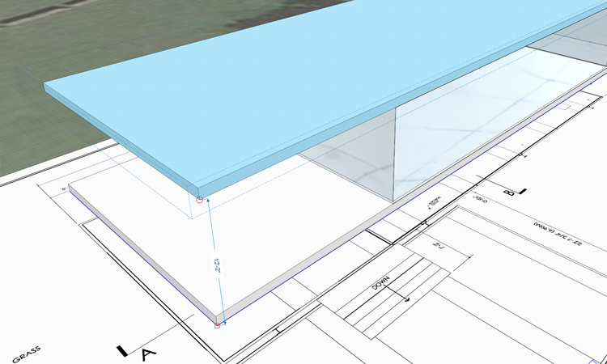

### Paint with Materials
As we saw in an **[earlier exercise](/Building-the-Farnsworth-House/Work-with-Images-and-the-Ground-Plane.md)**, you can create your own materials, and then paint those materials to faces in FormIt. In this exercise you will create and edit your own materials and import materials from the Autodesk Material library

#### Create the Glass Walls
1. Use the [**Rectangle-Tool-(R)**](../tool-library/rectangle-tool.md) to create another surface on top of the existing floor group

     

2. Click to start the rectangle sketch at the back corner of the existing floor. Draw the rectangle at these dimensions: **28'-8" x 55'-5 ½"**
     
3. Click **Esc** to exit the rectangle tool. **Single click** inside the new rectangle to select the face

     

2. Click to start the **Drag face** operation. Click the **Tab key** to set the height to **11'-2"**

3. **Double click** and **Group (G)** the new geometry

5. **Double click** the group to edit it. In the **Properties Palette** name the group **Glass Walls**

4. Right click on the top face and choose the [**Offset-Face-tool-(OF)**](../tool-library/extrude-cut-and-offset-faces.md)

5. Move you mouse cursor inward, and press the **Tab key** and type in **4"**

     

5. Click **Esc** twice to clear the tool, and the selection

6. **Single click** the interior top face to select it, then click again to start the **drag face** operation. Push the face all the way down, until it disappears

     

7. End **Edit Group mode** by double clicking off in space

8. Select the **Glass Walls** group with a **single click** and put it on the **Floor 1** layer

#### Import a Material from the Autodesk Material Library

1. Edit the **Glass Walls** group by double-clicking into it

2. Select the [**Materials Palette**](../formit-introduction/tool-bars.md)

3. Click the **Import Materials button**
     
     

4. In Materials Library dialog, choose **Glazing** from the categories on the left, and then choose **Blue Reflective**, and click **OK** 

     

5. In the Materials palette, **Single click** on the preview tile for the Blue Reflective material you just imported, now you can paint with this material

6. **Double click** the **Glass Walls** geometry to apply the material to the entire object

     

7. Click **Esc** to exit the **Paintbrush** tool, then **double click** off in space to exit the group

#### Quick Copy the Floor to Create the Roof

1. Select the **Floor** group with a **single click** 

2. Click one of the lower corners to start the **Move** tool 

3. Start moving the Floor up along the blue axis. Create a **quick copy** by clicking the **Ctrl key**. A "ghost" preview of the copy should appear 

     

4. While dragging along the blue axis, click the **Tab key** and enter **12' 2"**

     

#### Edit the Roof

2. While the copied group is still selected, use the **Make Unique (MU)** command

3. **Double click** the group to edit it. Re-name the group **Roof** in the **Properties Palette** 

4. Exit the group by **double clicking** off in space. Make a new **Layer** called **Roof** and put Roof group on it

4. Import the **Concrete &gt; White** material. **Single click** the material tile so you can paint with it

     

5. Single click the **Roof group** to paint it with the material. The entire group is painted!

_**Note:** This is a special technique that allows you to paint different group instances with different materials_

#### Create the Lower Terrace

3. Find the **lower terrace** on the floor plan and zoom into that area. 

4. You may need to toggle **Snap to Grid (SG)** on or off to hit the corner of image

4. Draw a **Rectangle (R)** **55' 3" long and 22'-7 3/4" wide**, then extrude it **1'**

5. **Double click** to select the geometry, then **Group (G)** it

6. **Double click** to edit the group and name it **Lower Terrace**. **Double click** off in space to exit the group

     

6. **Double click** to edit the group and name it **Lower Terrace**

4. **Single click** to select the Lower Terrace group. Click one of the corners and **Move** it up **2'-2"** off the ground plane

5. Import the material **Stone &gt; Travertine**

6. In the **Materials Palette**, find the **Travertine** material and **Double click** the preview tile

7. This launches the **Material Editor**. Click the **Color** preview. Change the **Val** to **190** to lighten the **tint** on the material 

     
     
6. **Paint** the **Floor 1** and **Lower Terrace** groups with the **Travertine** material 

     