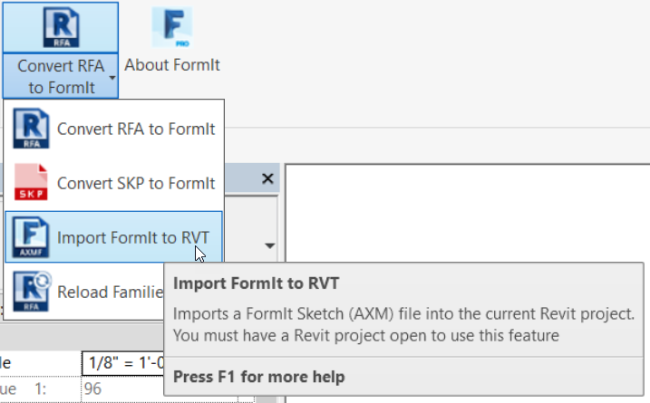
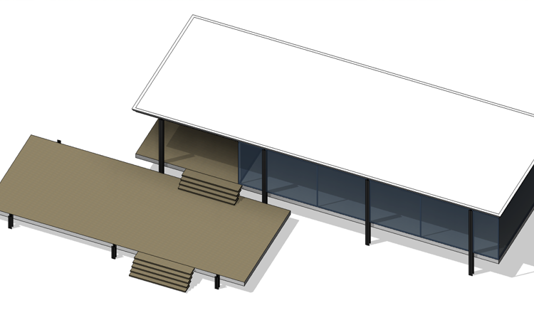
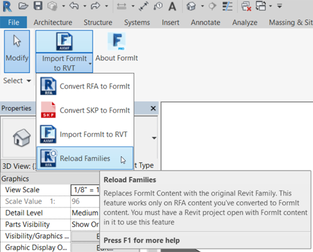
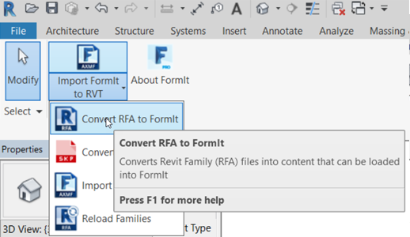

### Revit Interop
One of FormIt's most exciting features is the ability to move your model from a flexible modeling environment like FormIt, to a powerful parametric environment like Revit. We'll go through a few exercises that move elements from FormIt to Revit, and from Revit to FormIt

If you did not complete the last section, click the File &gt; Open and choose **farnsworth09.axm** from the FormIt Primer folder

#### Import Data from FormIt into Revit
In this exercise we will use Revit 2018 which has improved importing capabilities, as well as the ability to import materials from FormIt! Previous versions of the FormIt Converter do not have these features

1. Open the **farnsworth09.axm** file in FormIt. The **plan image** and the **furniture** layers are turned **off**

2. Only visible objects from the FormIt model will be imported to Revit in order to save processing time. This also gives you control over what is imported

1. Start **Revit 2018**. Start a new project from an **Architectural template** 

4. Go to the **Add-Ins** tab. Find the **FormIt Converter** panel. Choose **Import FormIt to RVT** from the drop down menu 

    

2. Choose **farnsworth09.axm** from the FormIt Primer folder

3. This process will take a minute. Revit converts each FormIt group into a family of the category we specified in FormIt

4. If there are any errors importing FormIt geometry, then Revit will list those. You can go back to FormIt and investigate these groups

5. Go to the **default 3D view**, and turn on **Realistic visual style**. Our model has imported with materials applied!

    

If you do not see some of the **Mass geometry** then you may need to enable the **Mass** category in the **Visibility Graphics (VG)** dialog

#### Revit Conceptual Mass Tools

1. Go to the **Massing and Site** tab in Revit. Find the **Conceptual Mass** and **Model by Face** panels

    

4. Select the **lower terrace**, it is a **Mass family**. Select the **Mass Floors** button in the ribbon. Choose the **Terrace** level from the dialog that appears. Now you can apply a Revit **Floor by Face** to this geometry. 

5. Click the **Floor by Face** tool from the **Massing and Site** panel in the ribbon. Hover over the edge of the lower terrace - it should highlight blue - click to select. Click the **Create Floor** button in the Ribbon. The floor is created **below** our FormIt floor. In the **Properties panel** change the **Offset from Level** parameter to be **1' 0"**. Repeat this step for the upper floor too

    

5. Select the **glass wall**, it is also a **Mass family**. You can apply a **Curtain system by Face**

5. The Columns however, are Generic family. This will allow us to edit the family and convert to another category such as Structural Column.

#### Reload Revit Families from FormIt

5. The various furniture objects are Furniture category. There is one more tool that we can use to automatically swap out the ones that were converted in the previous exercise. Select **Reload Families** from the add-in. 

    

6. In the dialog, select **FormIt Primer\\content.** This will point the converter at all sub-folders under this folder. Press OK. This process will take a number of minutes as it looks at each family and tries to make a match and reload the proper RFA file in its place. 

    

#### Export Data from Revit into FormIt

There may be times when you need to bring data from Revit into FormIt – e.g. when you have an existing Revit project that needs an area of the design to be iterated on. Export a 3D scene to the SAT file format from Revit and you will be able to import that data back into FormIt.

**Note**: *Family and category information is not transferred back to FormIt.*

### Convert Revit Families for Use in FormIt

1. Open Revit 2016 or 2017 and start a blank file from the Architectural Template. 

2. From the Add-Ins tab select **Convert RFA to FormIt ** from the FormIt Converter. 

    

3. Set the first path to **FormIt Primer\\content\\RFA** and the Converted Files path to **FormIt Primer\\content** and press OK.

    

4. This process will take a number of minutes as Revit opens each RFA in the first path and converts it to a format that FormIt can read.

**Note**: *You do not need to run this process during the tutorial, since all of the conversions have been made already. That is where the Corbu Chair and other content in the previous exercise came from.*

