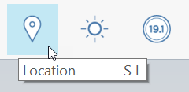
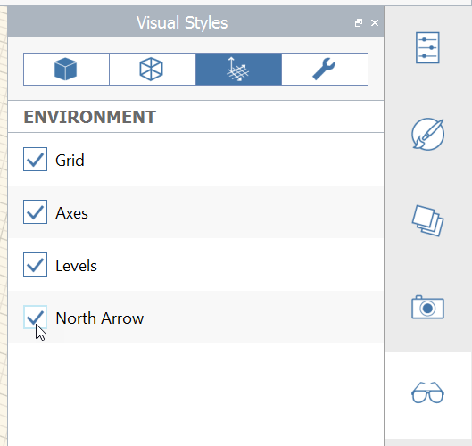

### Setting Location

Setting your project’s location in the world is important for the accuracy of down-stream analyses. It also allows you to import a scaled satellite image to use as a background reference. This is an ideal first step on almost every FormIt project.

#### Set Location:

1. Click the Location Icon from the toolbar

    
 
2. Search for **Farnsworth House** in the Google Maps search bar

3. Click **Import Satellite Image** to set the location and define the satellite image crop

    

4. Click **Import satellite image** and then **Finish Importing Image** button

    
    
5. The Satellite image is imported to real world scale with true North facing up

    

6. Go to the [**Visual Styles Palette**](../tool-library/tool-bars-extended.md), choose the Environment tab, and enable **North Arrow** to see a north arrow compass. You can also type DN keyboard shortcut to toggle the North arrow on and off

    

7. Finally **select the satellite image** by double clicking it. Click the [**Properties Palette**](../tool-library/tool-bars-extended.md) and lower the transparency slider about **1/3**. 

    