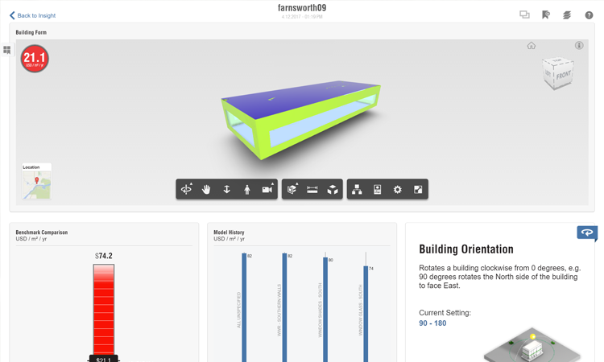

### Solar and Energy Analysis
Now that the model has been created we can utilize it to study the **solar and energy impact** of our design. These features are built into FormIt so your earliest studies can be understood from a building performance perspective. These features are **FormIt Pro** only, if you are following along on the web app, you may not have access.

If you did not complete the last section, click the File &gt; Open and choose **farnsworth09.axm** from the FormIt Primer folder.

#### Shadows
Before any of these analysis tools can be used, you need to [set the location](/Building-the-Farnsworth-House/Setting-Location.md). This gives FormIt access to accurate sun, shadows and climate data

1. Click on the Sun Icon in the [**Action Tool Bar**](../formit-introduction/tool-bars.md) and check on **Shadows (DS)**

    

2. Adjust the **Day** and **Time** sliders to see how the shadows change 

    

3. Notice how the covered terrace is shaded during the hottest hours of the summer months – surely not an accident, but a matter of design! 

**Note**: Shadows can cause software performance to slow down. Two suggestions for mitigating this: turn shadows off if you notice navigation getting slow; turn layers like **furniture** off if they aren't necessary to studying shadows

#### Solar Analysis
Being visual people, designers can learn and communicate an incredible amount of information from heat map diagrams like the one we're about to create

1. From the bottom of the [**Sun menu**](../formit-introduction/tool-bars.md), click the **Solar Analysis** button

2. You are put into a special mode where **shadows**, **keyboard shortcuts**, and other **toolbars** are disabled

3. The selection behavior is modified in **Solar Analysis** mode. You can select **through groups**, you don't need to hold down **Ctrl** or **Shift** to add to your selection set, and you can unselect items by clicking them again. You can **Single click**, **double click**, or **window select** geometry

3. Choose the faces you want to study. **Single click** the top of the **roof**, and the top of the **floors**. Avoid selecting small elements like furniture

    

4. In the top, left corner of the canvas find the **Solar Analysis** toolbar. Click **Analyze**. FormIt will calculate and render the surfaces. The settings here can be adjusted before **and** after the analysis finishes

    

3. The **Month Peak** setting shows the **peak** values (in BTU/sq. ft) for the specified month. This is intended for **shading studies**. You can change the month setting and the graphics update instantly. **Hover your cursor** over an analyzed surface to get a **specific** value

    

4. The **Year Cumulative** setting shows the **cumulative** energy for the entire year (in KwH/sq. meter). This is intended for **PV potential studies** 

    

### Energy Analysis with Insight 
FormIt has integrated the same Building Performance analysis tools that Revit uses. **Insight** provides a dashboard of parameters that be can be adjusted to reflect many potential scenarios without **re-analyzing** model geometry. Insight works best with FormIt **massing** geometry

1. Turn off **all** of the layers **except** for the **massing** layer. FormIt will only send **visible** geometry to Insight. Note that this simple **mass** will yield a trove of useful data from **Insight**

    

2. Click the **Insight &gt; Generate Insight** button. Your geometry must have at least one **Level** applied

    

3. The analysis will run in the cloud, so you can continue to model during the computation 

4. Once the analysis is complete, click the **View Insight** button to see your **Energy model** and the **dashboard of Energy factors** (optionally, you can visit the website directly at [http://insight360.autodesk.com](http://insight360.autodesk.com/)

    
    
5. If your design changes form drastically - then you can re-send the updated mass to the same dashboard. If you want to create a **new** dashboard for the updated design, then you will need to **Save As** in FormIt first

6. If your Energy Analysis is unsuccessful - you may have geometry based **Watertight Issues (DW)** these can be reviewed and fixed in FormIt