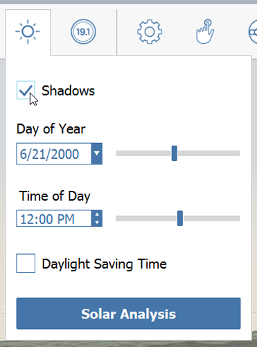
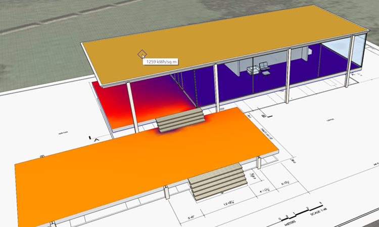

### Solar and Energy Analysis
Now that the model has been created we can utilize it to study the **solar and energy impact** of our design. These features are built into FormIt so your earliest studies can be understood from a building performance perspective. These features are **FormIt Pro** only, if you are following along on the web app, you may not have access.

If you did not complete the last section, click the File &gt; Open and choose **farnsworth09.axm** from the FormIt Primer folder.

#### Shadows
Before any of these analysis tools can be used, you need to [set the location](/Building-the-Farnsworth-House/Setting-Location.md). This gives FormIt access to accurate sun, shadows and climate data

1. Click on the Sun Icon in the [**Action Tool Bar**](../formit-introduction/tool-bars.md) and check **Display Shadows**.

    

2. Adjust the **Day** and **Time** sliders to see how the shadows change 

    

3. Shadows reveal import qualities of design, but they can also cause software performance to slow down. Two suggestions for mitigating this: turn shadows off if you notice navigation getting slow; turn layers like **furniture** off if they aren't necessary to studying shadows

Note how the covered terrace is shaded during the hottest hours of the summer months – surely not an accident, but a matter of design! 

#### Solar Analysis
Being visual people, designers can learn and communicate an incredible amount of information from heat map diagrams like the one we're about to create

1. From the bottom of the [**Sun menu**](../formit-introduction/tool-bars.md), click the **Solar Analysis** button

2. You are put into a special mode where **shadows**, **ambient shadows**, **keyboard shortcuts**, and other UI elements are disabled. 

3. The selection behavior is modified in **Solar Analysis** mode. You can select **through groups**, you don't need to hold down **Ctrl** or **Shift** to add to your selection set, and you can unselect items by clicking them again

3. Choose the faces you want to study. **Single click**, **double click**, or **window select** faces. Avoid selecting small elements like furniture

    

4. and click **Analyze**.

3. The Month Peak setting displays the peak solar insolation in BTU/sq. ft for that month. Hover your cursor over an analyzed surface to get a specific value. 

    

4. The Year Cumulative setting displays the cumulative energy for the entire year in KwH/sq. meter. This is useful for gaining an early idea of solar PV potential for surfaces of your design. 

    

### Energy Analysis with Insight 360
1. Hide all of the layers except for Massing.

2. Click the **Insight 360 &gt; Generate Insight button.** Any visible masses with levels applied will be sent to Insight 360 for Analysis.

    

3. Once the analysis is complete – click View Insight to view the results. Optionally, you can visit the website directly at [http://insight360.autodesk.com](http://insight360.autodesk.com/).