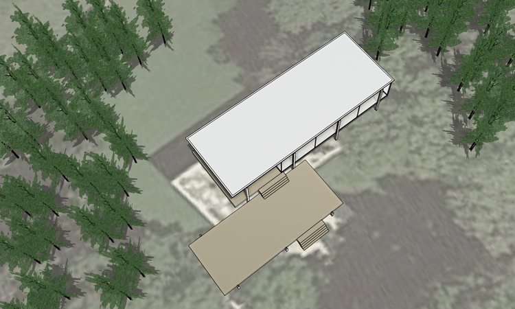
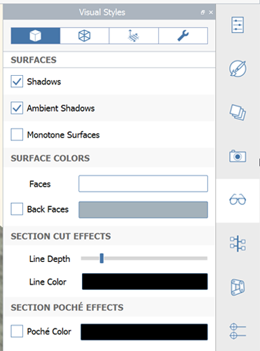
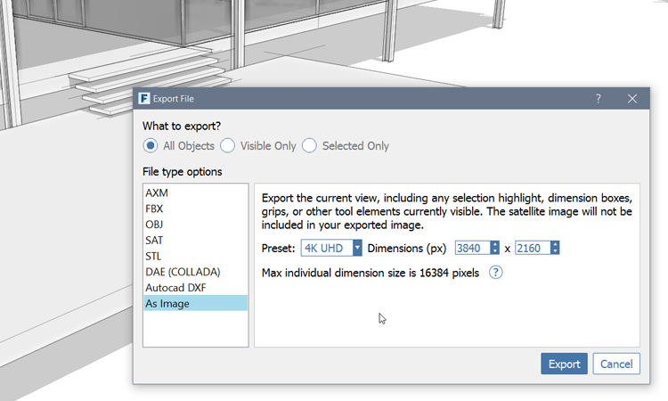

### Visual Settings
Moving your conceptual model to Revit for documentation is only half of the deliverables that come from FormIt. The other half are beautiful graphics that help to tell a story to a client, or team member. We'll cover ways to set up your **camera scenes**, your **graphic visual styles**, and **export your images** at high resolution.

If you did not complete the last section, download and open the **farnsworth10.axm** file from the [FormIt Primer folder](https://autodesk.app.box.com/s/thavswirrbflit27rbqzl26ljj7fu1uv/1/9025446442).

#### Scenes

1. Open the **Scenes** palette

    

2. **Double click** the only saved Scene - the camera animates to take you to that stored viewpoint 

3. The visual styles, shadow settings, and layer states update to what was stored when that scene was set up

2. In the [**Scenes Palette**](../formit-introduction/tool-bars.md) click the **"+"** icon to add a new scene

3. In the **Scene Properties** - lower in the palette - rename the new scene and **Aerial**. The checkboxes determine whether changes to these settings affect the scene

    

4. Navigate the camera to an aerial view. Turn on the **trees** layer and turn off the **plan image** layer

    

5. **Single click** on the **Aerial** scene and then click the **update** icon. This will reset the scene to the current camera viewpoint and properties

     

7. Press the **Play** icon to animate the camera through the saved scenes

    

#### Visual Settings

1. Click the **Stop** icon to end the animation

2. **Double click** the original **Scene** to navigate to it. Turn on the **trees** layer and turn off the **plan image** layer. Update the scene to record these changes

2. Select the [**Visual Styles Palette**](../formit-introduction/tool-bars.md). There are four tabs at the top for different effects: **Surfaces**, **Edges**, **Environment**, and **Model Diagnostics**

    

4. Turn **Monotone Surfaces (DM)** on. This makes an abstract black and white image without any materials 

    

5. Turn on Ambient Shadows, and from the Edge tab, adjust the sliders to make the contrast of the edges and silhouette edges lighter

#### Export Image

Once you have you one or more scenes with visual styles to your liking, you can export high resolution images of the scene.

1. **Click File &gt; Export (Ctrl + E)**.

2. Choose **As Image** from the list.

3. Choose the resolution from the Preset list or enter a custom pixel dimension. 

    