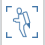

### Navigating the Scene
---
> Here are the key tools on the Navigation Tool Bar for moving around the design area. 

---
**1. Orbiting**
 
Right click and drag, or use the orbit tool from the navigation toolbar to click drag the left mouse button to orbit.

**2. Zooming**
 
Scroll the mouse wheel or use the zoom tool from the navigation toolbar to click drag the left mouse button to zoom.

**3. Panning**

Click and drag the middle mouse button, or use the pan \(hand\) tool from navigation toolbar to click drag the left mouse button to pan.

**4. Walkthrough**

The “Jetpack” allows you to walk and fly through the scene. This will be covered in detail in a later section.

**5. Swivel**

Use the swivel tool from the navigation toolbar to swivel around the scene from a specific point. 
