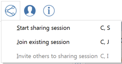

### Collaboration
---

> FormIt allows multiple users (on any combination of iOS or Web clients) to collaboratively edit a FormIt model – while seeing all of their changes in real time! Work sumultaneously with others on the same sketch or share your work later. 

> **Note:** Collaboration works only after your activate FormIt 360 Pro. Clicking on the Collaboration icon will prompt you to lof in with an AutoDesk 360 account entitled for FormIt 360 Pro. 

---

#### Start a Collaboration Session

1. Start a session – this will start a collaboration session. 

2. You can now email a link to a colleague. When they open the link, they will be asked to log into A360 and then you can start collaborating immediately. 

3. To see this in action, visit this link: <http://formit.autodesk.com/blog/2014/12/04/design-is-a-team-sport-ios-version/>.

#### Ending a Session
Select **End Sharing Session** from the collaboration drop down meno. A guest cannot end a sharing session. 