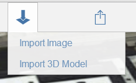

# Import and Modify Ground Overlay Images

----

Acquire images for your design canvas and alter them if desired.

## Importing Ground Overlay Images

1. To import an image, select the Import button from the toolbar.

1. Select an image from your local file system or your A360 drive.
2. Edit the image if necessary. 
    
    
3. Click OK to add the image.

## Modify Ground Overlay Images

1. Use the palette on the right-side of the screen to modify image properties.
2. From the palette, you can edit the image's name and transparency.
3. Drag and Drop using the Vertical Order panel to organize the placement (order) of all the ground overlay images, including any imported satellite imagery. 
    
    
