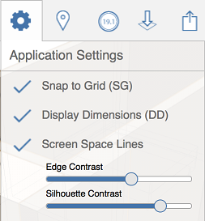

# Application Settings

----

Modify application-wide settings to change how the entire FormIt 360 app appears and behaves.
 

### Application Settings

| | |
| ---- | ---- |
|    |    * *Snap to grid*: Toggle this feature to turn grid snaps on and off ** * *Display dimensions*: Shows numerical values for an object's length, width, etc. ** * *Screen Space Lines:* Enable this feature to improve the graphic display of complex models. Control the contrast of silhouette edges as well as regular edges. ** * *Edge Contrast:* Raise or lower the contrast of how edges are displayed.           **          *Silhouette Contrast:*Raise or lower the contrast of how silhouette edges are displayed.   |

