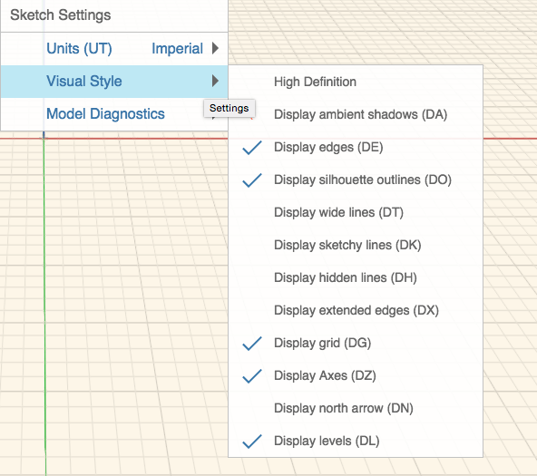

# Sketch Settings

----

Change sketch-specific settings to change how the current sketch appears and behaves.

### Sketch Settings

| | |
| ---- | ---- |
|    |    *Units*: Change units to Imperial (feet and inches) or Metric  *Visual Style*  * *High Definition*: Improve how graphics appear on high pixel density displays. This setting may result in decreased performance * *Display ambient shadows*: Toggle this feature to add a soft shadow effect to your model * *Display edges*: Toggle this feature to turn off edges in your model. This option works well with Ambient shadows for presentations * *Display silhouette outlines*: Forms will be emphasized by drawing a slightly wider line around the silhouette edges * *Display wide lines*: Widest lines possible * *Display sketchy lines*: Change the appearance of your sketch by toggling making lines to appear that they have been sketched by hand * *Show hidden lines*: Display faint lines that are normally hidden by other faces * *Display extended edges*: Display short extensions where lines intersect * *Display grid*: Toggle the visibility of the grid * *Display axes: *Toggle the visibility of the coordinate system axes * *Display north arrow: *Toggle the visibility of the north arrow * *Display levels*: Toggle the visibility of the levels    |
|    |    *Model Diagnostics*  * *Display Backfaces: *Faces that are abnormally facing outward will be displayed in a purple color * *Display Watertight Issues*: Holes in faces and lines/edges not associated with an object will be displayed in a purple color   |

