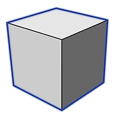

# Place Primitives

----

Use pre-defined shapes as design building blocks.

## Place a Primitive

1.  Placing primitives provides a second way to create content.
2. Click one of the five shapes on the primitives palette.
3. Click in the drawing area to place the image.
