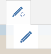
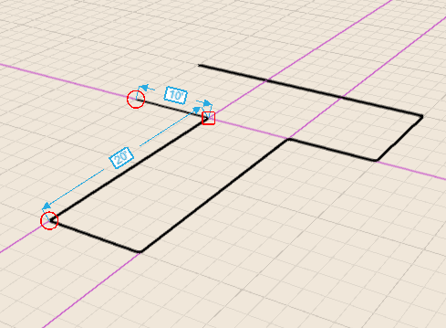
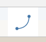
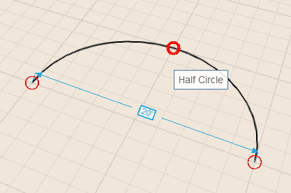
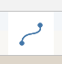
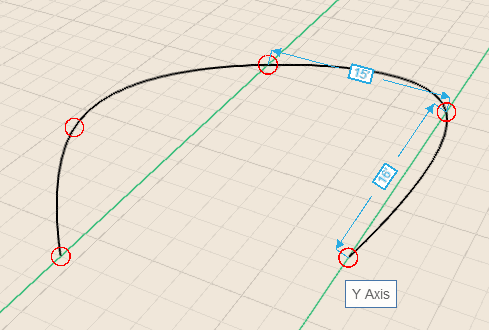
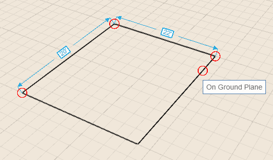
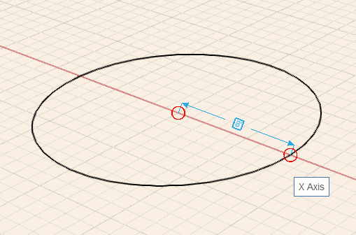

# Sketching Shapes

----

Use Lines, Arcs, Splines, Rectangles, and Circles to create shapes that you can combine into building designs.

After selecting a drawing tool, you can hover anywhere on the canvas to use snaps and inference points before you place your first point.

## Using Lines

 
1. Click your mouse once in the drawing area to place the first endpoint of the line.
2. Use hover, snap / inference, click - to place the second endpoint of the line.
3. To draw the next line segment, you will need to click to create another endpoint.

Once you start drawing a line on an axis, pressing the shift key locks the line to that axis so that you can extend it without worrying about leaving the axis.
NoteUse the Tab key to open the Set Length dialog that allows you to type in a length value. When Snap to Grid is turned off, the values in the Set Length box appear in whole numbers; with Snap to Grid on, the numbers appear in fractions of a foot or meter.
## Using Arcs

 
1. Click your mouse when you are ready to place the first endpoint of the arc.
2. Follow the same steps of hover, snap / inference, click - to place the second endpoint of the arc.
3. To finish the arc, click once more to define the arc angle. 

## Using Splines

 
1. Click your mouse once you are ready to place the first endpoint of the spline.
2. Follow the same steps of hover, snap / inference, click - to draw the next spline point.
NoteThe spline curve appears automatically.
1. Click the original spline end point to close the loop of sketch lines and create a plane.

## Using Rectangles

 
1. Click your mouse once you are ready to place the first corner of the rectangle.
2. Follow the same steps of hover, snap/inference, click - to place the second corner of the rectangle.
3. Finally, follow the same steps as before to place the third corner of the rectangle.

## Using Circles

 
1. Click your mouse once you are ready to place the center point of the circle.
2. Follow the same steps of hover, snap/inference, click - to define the radius of the circle.
