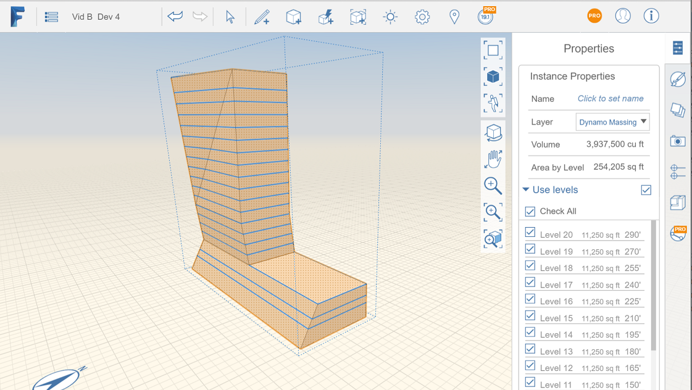

# Apply Levels

----

Like the Revit software, you can use level values to define a vertical height or story within a building sketch.

See About Levels to understand levels.

## Apply Levels to Objects

1. Select the entire object and then open the right-side Properties palette
2. Click the Use Levels check box
3. Click the checkbox for each level you want applied to this object
4. The Properties palette will display the total Gross area for each level as well as a total for this object

5. 
