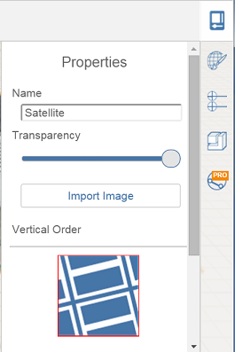

# Edit, Reload, or Remove a Satellite Image

----

Make changes to your location images.

## Working with Satellite Images

1. To remove or edit a satellite image:
2. Double click to select the image and then press Delete; or,
3. From the context menu: Double click to select the satellite image, then right click over the image to bring up the context menu; chose the delete icon.

#### To Edit satellite images:

1. Similar to other images, you can edit the name, transparency, and vertical order of a satellite image. 
    
    

#### To reload a satellite image:

1. Simply repeat the process to import a satellite image.
