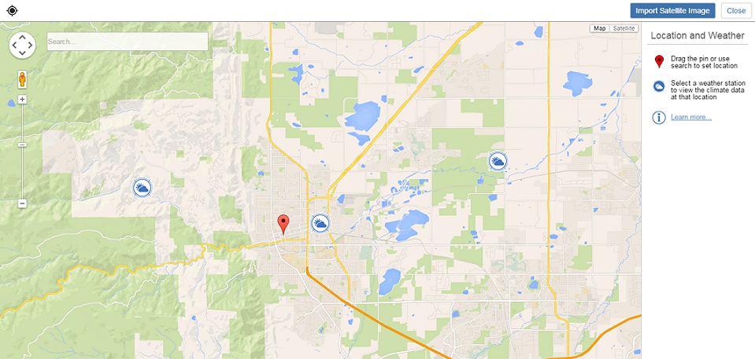

# Import a Satellite Image

----

Add detail and realism to your design.
 

Satellite images and weather station data add important information to your designs.

#### Import Satellite Image

1. Click on the Location icon from the action tool bar.
2. Search for a specific location or use the map view to pan and zoom to set a location.
3. Click to place the red pin after you have found your location.
4. Click Import Satellite Image to add the aerial photo to your sketch.
5. Use the dialog that appears to crop the satellite image to show the relevant context for your sketch.
6. Either: 
    * Click Finish. 
        
        This action will return you to the drawing area and set the location of the project without importing the satellite image. You can always return later to the Location screen to import the satellite image.
    * Click Finish Importing to set the location and add the location's satellite image to your drawing area.

1. Click any of the nearby Weather Stations to review the local historic climate data.
2. Click the X in the upper right corner to dismiss the weather station display.

