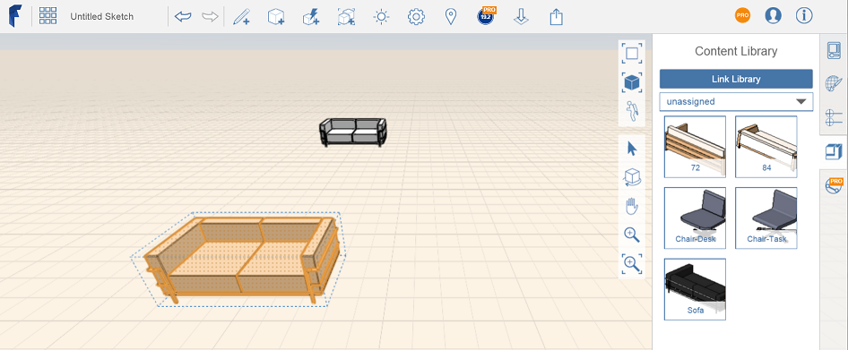
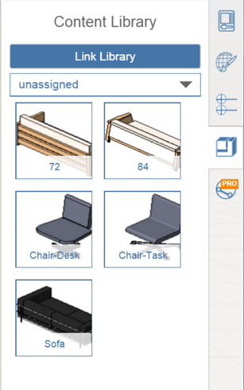

# Link a Content Library

----

Access previously stored projects and site files.
 
1. Click the Content Library icon in the properties panel to the right side of the canvas. 
    
    
2. Click on the 'Link Library' button.
3. Choose your library location - either on your local drive, or on an A360 Drive. 
    
    
4. Browse with the file navigation dialog to your top-level content library folder.
5. Choose a content file. 
    
    
