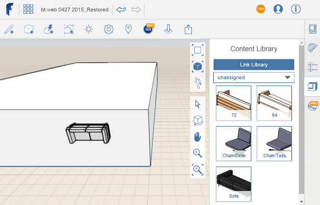

# Place Content

----

Use the data from a content library file in a design.
 
Note If you have linked your library locally, and then start a new FormIt 360 Web session, you will need to re-link the Content Library.
1. Hover your mouse over a thumbnail image.
2. Drag and drop the content onto the canvas, or click the thumbnail, move the mouse onto the canvas, and then click again to place.

