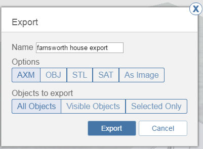

# Export Files and Images

----

Save files to your A360 drive or to local storage
 

1. Click the Export icon to open the Export menu. 
    
    
    
    
2. Choose an export format to save on A360 or Locally. 
    * AXM Saves in the FormIt 360 file format
    * OBJ format saves the material definition and mesh data. This is useful for opening in 3DS Max and other systems that support OBJ
    * STL is a standard 3D mesh interchange that is useful for 3D printing workflows
    * SAT is a standard 3D solid interchange format
    * Image saves the current view as a PNG without the user interface components

3. Choose whether you want to export All objects, visible objects, or just the currently selected objects
