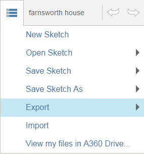

# Saving Your Work

----

Preserve your designs in multiple formats.
 
* All your sketches can be saved and accessed from either you local drive or on http://360.autodesk.com . 
    
    

When a sketch is saved to http://360.autodesk.com three files are created in AXM, SAT, and RVT formats (the latter for opening in Revit software-based products).  The Revit file can be downloaded locally, and opened directly in Revit
