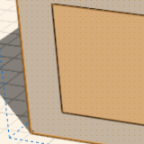

# About Smart Selection

----

The TAB key provides a way to make selecting similar objects easier.
 

Accelerate the pace of geometry placement and modification by using the TAB key.

* Select same sized faces: Hover over a face, hit the tab key, all the faces on the solid that are the same size highlight - single click to select them all. 
    
    
* Select cluster of faces: Hover over a face that is part of a cluster of faces, hit the tab key twice, all the faces that are part of the cluster highlight - single click to select them all 
    
    
* Select same sized cluster of faces: Hover over a face that is part of a cluster of faces, hit the tab key three times, all the clusters of faces that are the same size on the solid highlight - single click to select them all 
    
    
* Depth selection: Hover over a face that is on top of a group instance, hit the space bar to cycle through selection options are in the same plane, click to select the face you want 
    
    
