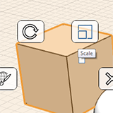

# Modify: Scale and Rotate

----

Adjust the size and orientation of objects.

1. To scale edges, faces or objects, first select, right-click to access the context menu, then choose the scale icon. Use the scroll wheel on your mouse to scale the geometry up or down.
2.  To rotate edges, faces, and objects, select elements and right click to access the rotate tool from the Context menu. A protractor graphic will appear on your mouse, click to set the plane for rotation. You can use the blue grips to specify the start point of the rotation, and reset the axis if necessary. Use the arrows or the editable dimension box to set the rotation angle. Note that you can use the Q key to access the rotate tool after selecting an element.
