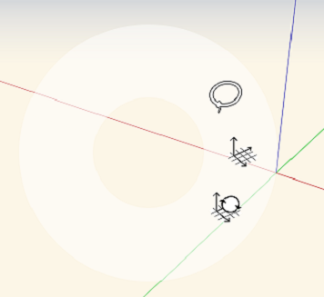
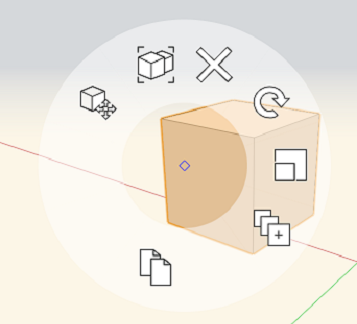
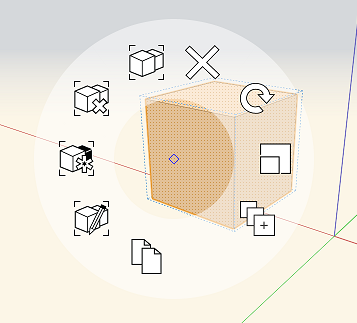
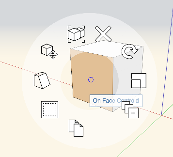
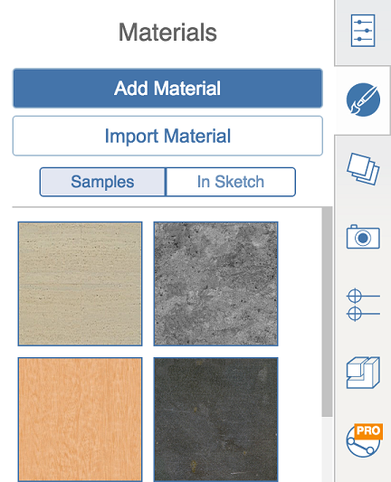
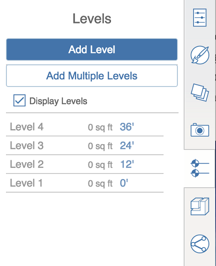

# Context Menu and Right-Side Palettes

----

Locate the tools to create and place designs.
 

The software's user interface makes use of a Context Menu and a Palette.

* To view the context menu, right-click over an object or on empty space. Depending on the selection set, different tools will appear on the contextual menu that will let you edit the selection. 
    
    | | |
    | ---- | ---- |
    |    Canvas context menu   |      Solid context menu   |
    |    Groups context menu   |      Face context menu   |

## Palettes

* | | |
    | ---- | ---- |
    | Click on the palette handle to reveal, or to hide the Properties Palette. Use the Properties Tab to manage an object's name, level settings, layer setting and view information about area and volume of the selected object.   |      |
    | Use the Material Tab to create, edit, and apply materials to objects.   |      |
    | Use the Levels tab to create and edit the levels in your sketch - but not to set levels on an element, that is done in the Properties tab   |      |
    |  Use the Content Library to link a Library from your local computer, or from A360 Drive. Then you can drag and drop content from the library into your FormIt 360 sketch.   |      |
    | Use Collaboration to work simultaneously with others as you create designs.   |      |
    | Use the Layers palette to create and modify layers. You can also add currently selected object(s) to a specific layer.   |      |
    | Use the Scenes palette to create and modify scenes. Press play to cycle through all of the scenes in the current file in order.   |      |
[Please send us your comment about this page](#)