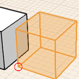
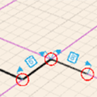
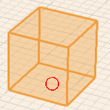
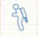

# Navigation Tools

----

Use these movements to engage the user interface.
 

Key tools for moving around the design area.

### View Modes

| | |
| ---- | ---- |
| Top View   |   View your project from a top view. You cannot orbit when in this view, but pan and zoom work normally. This view is especially useful when sketching floor plans over an imported sketch, or satellite image.   |
| 3D View   |   This is the perspective view that FormIt 360 starts in. You can orbit, pan, and zoom to view and edit your model.   |
| Fly-Through Mode   |   Enter a First person perspective mode at ground level. Your editing tools are disabled, but you can walk or fly-through your model using your keyboard and space bar. When you exit this mode using the esc key, you return to 3D View mode, your point of view is maintained.   |

### Navigating the View

| | | |
| ---- | ---- | ---- |
| Pan   |   Middle mouse button press and drag   |     |
| Orbit   |   Mouse right-click and drag   |     |
| Zoom in and out   |   Middle mouse scroll wheel   |     |

### Create Geometry Gestures

| | | |
| ---- | ---- | ---- |
| Copy Objects   |   Select object, ctrl+C, then click ctrl+V   |      |
| Draw 2D Shapes   |   Click on the line, arc, spline, circle, or rectangle tool, then click in canvas to draw.   |      |
| Extrude Shapes   |   Click to select a face, then click and drag your mouse - click again to finish extruding a face.   |      |
| Place a Primitive   |   Click on primitive from action bar, then click in the canvas.   |      |

#### Fly-Through Mode

* Fly-through mode lets you choose a perspective for the camera angle view of your design. It also lets you perform an automated aerial overview of the drawing area. Use the Jet Pack icon to enter fly-through mode.

### Fly-Through Mode Keyboard Controls

| | |
| ---- | ---- |
| Walk   |   W moves forward, S moves backwards, A moves left, D moves right   |
| Climb   |   Q steps up, E steps down   |
| Jet Pack   |   Space bar lifts off   |
| Look Around   |   Mouse point to where you want to look   |
| Exit   |   Press esc to exit Fly-through mode   |

