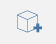
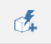
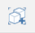
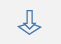
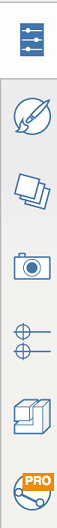

# User Interface Tools

----

Reference for command interaction tools.

## Information Area

*  Save the Sketch: Click to save the current sketch, or open a new sketch.
* Set the name: Click to change the name of your sketch.
* Undo and Redo: Click to undo or redo recent actions.
* *Navigation Bar* 
    
    | | |
    | ---- | ---- |
    |    |  *Top View*: Go to orthogonal view looking down   *3D View*: Go back to the default 3D perspective view  *Jet Pack*: Go to a walkthrough view using traditional gaming controls. W - forward, S - Back, A - Left, D - Right, Q - Up, F - Down, Space Bar launches you into the air  *Select*: Puts you back into Select mode  *Orbit*  *Pan*  *Zoom*  *Zoom to Fit*   |

## The Action Bar

* The action bar is found at the top of your screen. The tools in the action bar will help you create, edit, and share content. 
    
    

* User Identity, Help Bar 

*  Selection Filter: Click to choose options for filtering out object types from the selection tool
* Measure Tools: Click to choose a linear or angular measure tool
* Sketch Tools: Click to bring up a menu of creation tools that will help you draw shapes.
* Primitives: Click to bring up a menu of basic 3D shapes that you can place in your scene.
* Advanced Tools: Click to use Boolean cut or join, cover, sweep, or loft operations.
* Groups: Click to locate tools for grouping objects.
*  Sun and Shadows: Use this tool to change the date and time of day to study shadows on your model. For more info on sun and shadows, see [Sun and Shadow Settings](GUID-E1FF3C3D-2A9F-4AF8-866C-CAED491DF6E3.htm). Launch Solar Analysis from within this panel.
* Settings: Set application and sketch settings along with visual style and perform model diagnostics.
* Search for a location and import satellite imagery into your sketch. For more information on setting the location of your sketch.
* Energy Analysis: Click tp perform calculations on a building to determine its energy use.
* Import Images and Models: Use this tool to add images and models you created with other programs.
* Share Your Work: Export your model into different formats.
*  Obtain access to Solar Analysis, Energy Analysis, and Collaboration features
* Login to Autodesk 360: Use the Autodesk 360 Cloud Services for FREE to store and share your sketches.
* Help: Use the information tools to learn more about FormIt 360.

## Palette Bar

The Palette Bar appears on the right side of the screen. Click one of these icons to open a side palette to display building properties, materials, a content library, and collaboration tools.

| | |
| ---- | ---- |
|    |    *Properties*: Open this palette to view location, gross area, and floor area ratios for your sketch  *Materials*: Use this palette to create or apply materials  *Layers*: Create and Manage Layers and assign selected objects to different Layers  *Scenes*: Create, manage and play Scenes  *Levels*: Use this palette to display and add levels to your building objects  *Content Library*: Use the content library to store reusable content such as furniture  *Collaboration* (FormIt 360 Pro only): Use Collaboration to work simultaneously with others as you create designs   |

[Please send us your comment about this page](#)