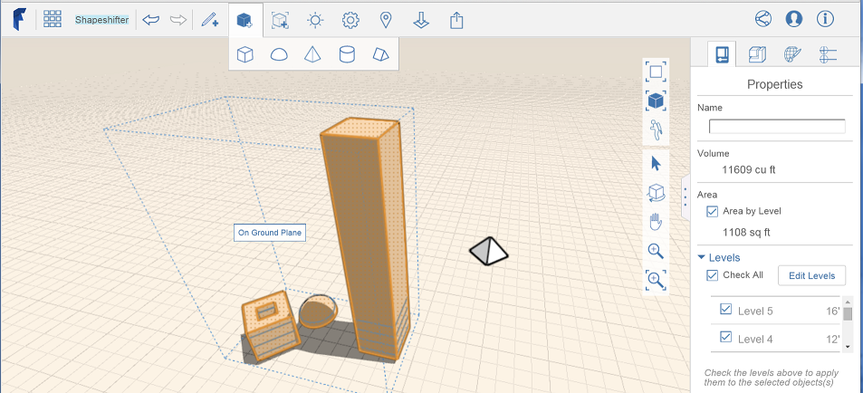

# Apply Levels and Materials to a Group

----

A way to affect many objects at once.
 

## Apply Levels

1. Select an object from the group, but do not enter edit mode.
2. Open the right-side Properties palette.
3. With Area by Level turned on, select Levels to choose what levels to apply to the selected objects.

## Apply a Material

| | |
| ---- | ---- |
|  1. Select a group, edit it by double-clicking it and then open the palette on the right side of the screen. 2. Use the Materials tab to find and apply a material from the built-in Samples or by[ creating a new one](GUID-BD42BB74-22BE-426E-AF9D-3524E65DC732.htm) . 3. To apply a material that was created in one group to another group, click the In Sketch tab in the Material palette. 4. Browse the list of groups to find the material you would like to apply to the current group. 5. Hover the mouse over the material, click the paint brush icon and paint the material onto selected faces. Note: you can also apply materials to individual group instances without editing the group.   |      |
| |     |

[Please send us your comment about this page](#)