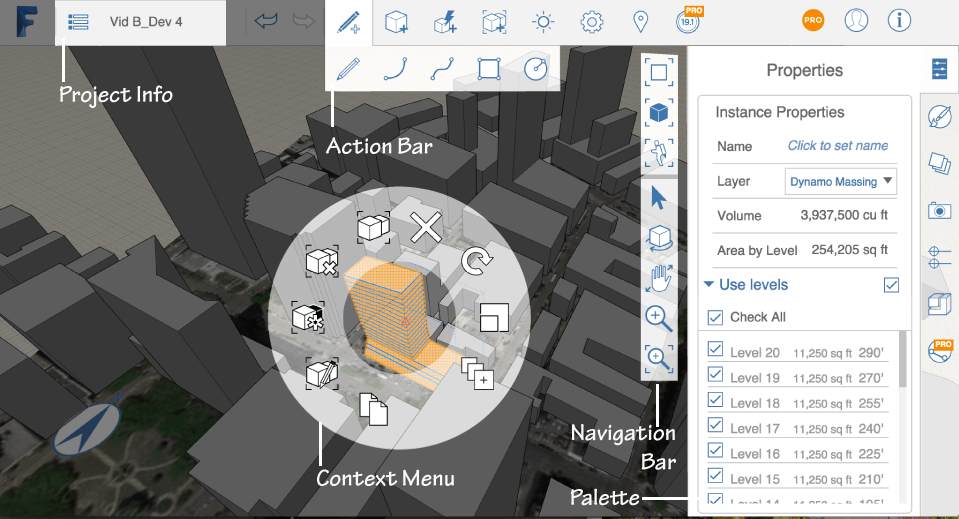

# Welcome to Autodesk FormIt 360 and FormIt 360 Pro

----

Discover how to create conceptual building designs while initiating a BIM workflow.
 

Use Autodesk ®  FormIt ®  360 to capture building design concepts when ideas occur. Create those ideas in a portable digital format that can use real-world site information, such as satellite images, to orient your designs. Use real building and environmental data to support design brainstorming. Move your preliminary designs to centralized data storage for access and refinement in Autodesk ®  Revit ®  software or other applications.

[Autodesk ®  FormIt ®  360 Pro](http://www.autodesk.com/store/formit-360?licenseType=cloudSub&term=monthly) provides additional features, including:

Visit the[ FormIt 360 YouTube Channel](https://www.youtube.com/channel/UCdZJr6Bo4pwBu3lQqcxlDsw) to view the full list of tutorial videos.

[What's New](https://www.youtube.com/watch?v=dDNxDf05k2Y&list=PLqumTDi1CVHOtEqVu0Efnh0TLYKml8Fer)

* Contextual Menu 
    
    
