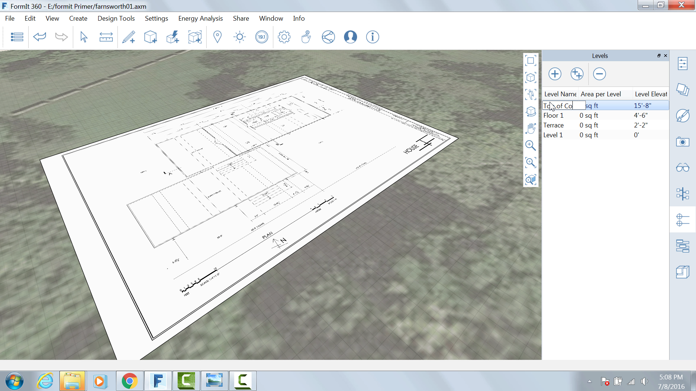

### Create , Edit, and Apply Levels

You can create new levels using the Level tab on the Levels Palette

Click Add Level four times to add a single Level at 0’0, 2'2 , 4’6 and
15’8 (you can also click the ++ icon to create multiple levels – handy
for tall buildings)

Edit the Level name. Name the first one **Level 1, Terrace, Floor 1, and
Top of Cornice** – these level names will now translate into Revit

Select the main massing and in the Properties tab, click Apply Levels
and only check Main Floor. The Properties tab now reads the area of this
mass

****