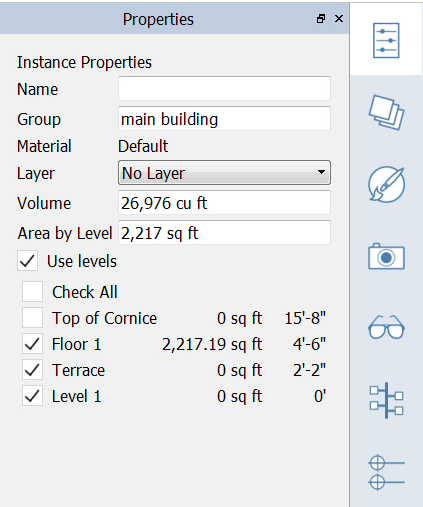

### Apply Levels to a Group

Select the main building by single-clicking and open the Properties tab
of the Palette

Check the Use Levels ON. This will "slice" these masses by the levels
you choose. Click **Check All**

The Area by Level will display gross area of the currently selected
object(s) and the area of each individual level

If you do not see blue level lines on the object, go to the Settings
menu &gt; Visual Style &gt; Display Levels (DL)

