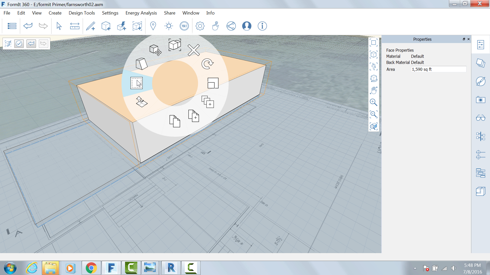

Materials
---------

As we saw in the last exercise, you can apply materials to faces in
FormIt. In this exercise you will create and edit your own materials and
import materials from the Autodesk Materials library

### Create the glass walls

Use the Rectangle tool ( R ) to create another surface on top of the
floor, **28'8" x 55'-5 ½"**

Pull the new surface up **11'2"**

Group it and name it **Glass Walls.**

Right click on the top face and choose the Offset Face tool (O F)

Press Tab and type in **4"**

