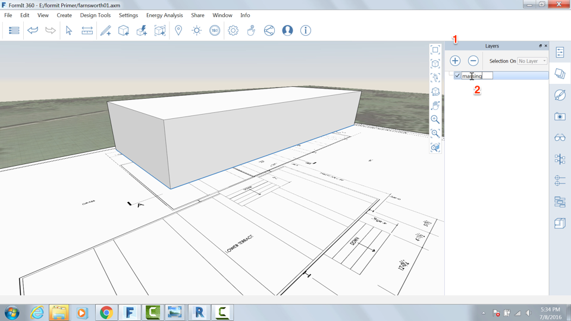
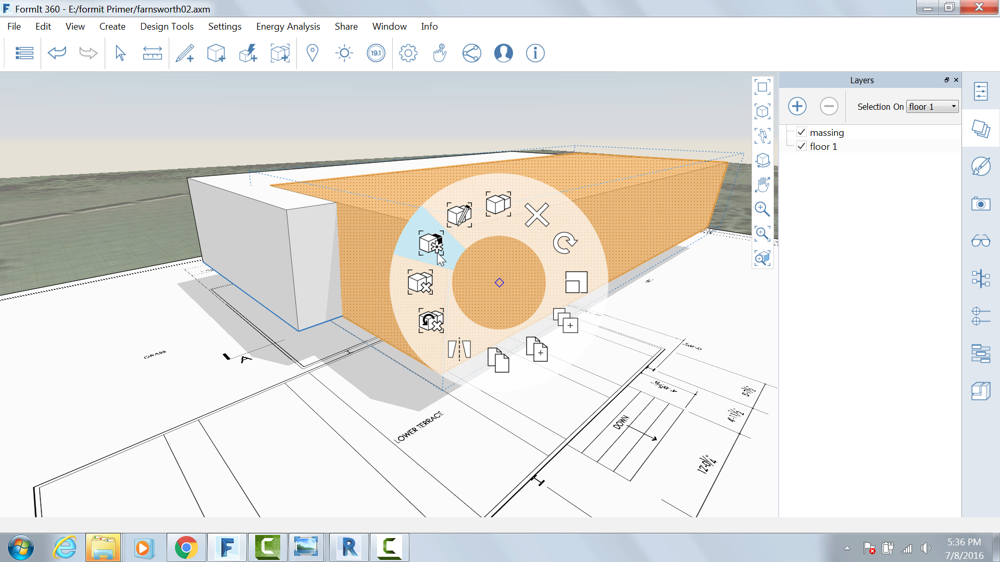

Layers
------

Much like AutoCAD and Photoshop, Layers in FormIt allow you to manage
the visibility of objects in your scene. We are going to create a layer
to save and hide the building mass for later analysis.

Click the Layers palette and click the + sign twice to create three
layers

1. Double click the layers to rename them: **massing, Floor 1, plan image** 

2. Select the massing Group and choose the massing layer from the "Selection On" menu in the Layers palette

Create a copy of the Group by pressing **Cntl+C** and then **Cntl+V**

Right click on the copied Group and choose **Make Unique (MU)** the
Group is now its own unique Group and will not update with the other one

Select the newly created group and choose **Floor 1** from the menu. This will be the basis for the first floor

Move it to exact spot of the original Group by selecting the lower left
corner

Uncheck the **massing** layer to hide it

Edit the floor 1 group and select the top face. Move it down **11'2".**
The resulting floor should be 1' thick.

Select the plan image group and create and assign it to a new **Plan
Image** layer